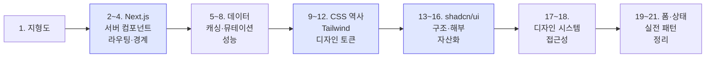

# 0. 오리엔테이션

이 덱을 어떻게 읽으면 되는가

---

## 이 덱은 누구를 위한 것인가

<v-clicks>

- **React는 써봤는데** Next.js App Router의 서버/클라이언트 구분이 아직 흐릿한 사람
- Tailwind를 쓰고는 있지만 "클래스가 길어서 지저분하다"는 찜찜함이 남아 있는 사람
- shadcn/ui를 **복붙 컴포넌트 모음** 정도로만 알고 있는 사람
- 팀에 디자인 시스템을 도입해야 하는데 어디서부터 손댈지 모르겠는 사람

</v-clicks>

<v-click>

전제하지 않는 것: 디자인 감각, CSS 심화 지식, 백엔드 경험

</v-click>

---

## 이 덱의 한 가지 약속

<div class="text-2xl py-6 leading-relaxed">
이 자료에 나오는 UI는 <strong>스크린샷이 아니다.</strong><br>
지금 이 슬라이드 안에서 실제로 렌더된 DOM이다.
</div>

<BtnMatrix :sizes="false" />

<div class="pt-3 text-sm opacity-70">
클릭도 되고, 호버도 되고, 뒤에서 볼 테마 전환도 실시간으로 동작한다.
"이렇게 생겼다"는 설명 대신 <strong>보여주는 것</strong>을 기본값으로 삼았다.
</div>

---

## 다루는 것과 다루지 않는 것

<div class="grid grid-cols-2 gap-6 pt-4">
<div>

**다룬다**

- 세 도구가 각각 **무슨 문제를 풀려고** 나왔는지
- Next.js 서버/클라이언트 경계와 캐싱 모델
- Tailwind가 CSS 방법론 논쟁을 어떻게 끝냈는지
- shadcn/ui의 소유권 모델과 **컴포넌트가 자산이 되는 경로**
- 기존 디자인 시스템을 토큰 레이어로 얹는 실무 절차

</div>
<div>

**다루지 않는다**

- React 기초 문법 (useState, props 등)
- 디자인 이론, 색채학
- 백엔드/DB 설계 (Supabase 덱 참고)
- 테스트 프레임워크 상세
- React Native, 모바일 앱

</div>
</div>

---

## 전체 로드맵



색칠된 세 덩어리가 이 덱의 뼈대다. **12장(토큰)과 16장(자산화)**이 가장 중요한 두 장이다.

---

## 미리 잡아두면 좋은 멘탈 모델 3가지

<v-clicks>

**1. Next.js는 "React를 서버에서 실행하는 방법"이다**
번들 크기, 워터폴, SEO를 각각 따로 고치던 문제들이 하나의 모델로 합쳐졌다.

**2. Tailwind는 CSS를 대체하는 게 아니라 "이름 짓기"를 대체한다**
`.card__header--active` 같은 이름을 고민하던 시간이 사라진다. CSS는 그대로다.

**3. shadcn/ui는 라이브러리가 아니라 "코드 배송 시스템"이다**
`node_modules`가 아니라 **내 레포에** 컴포넌트가 들어온다. 이 차이가 전부를 바꾼다.

</v-clicks>

---

## 실습 환경 준비물

```bash
# Node 20.9+ (Next.js 16 요구사항)
node -v

# 새 프로젝트 한 방에
pnpm create next-app@latest my-app
cd my-app

# shadcn/ui 초기화 → 첫 컴포넌트
pnpm dlx shadcn@latest init
pnpm dlx shadcn@latest add button
```

<v-click>

<div class="pt-3">
이 덱은 <strong>Next.js 16.3 / React 19.2 / Tailwind CSS 4.3 / shadcn CLI 3.x</strong> 기준으로 쓰여 있다.
버전이 중요한 지점마다 "예전 방식"을 함께 표시해 두었다.
</div>

</v-click>

---

## 2026년 8월 기준 — 바뀐 것들

이 생태계는 빠르게 움직인다. 검색으로 찾은 글이 이미 낡았을 수 있다.

| 항목 | 지금 | 예전 (자료에 많이 남아 있음) |
|---|---|---|
| Next.js 미들웨어 | `proxy.ts` | `middleware.ts` (deprecated) |
| Next.js 캐싱 | Cache Components + `use cache` | `fetch(next: { revalidate })` |
| Next.js 번들러 | Turbopack (기본) | webpack |
| Tailwind 설정 | CSS의 `@theme` | `tailwind.config.js` |
| shadcn 기본 베이스 | **Base UI** | Radix UI |
| 합성 프롭 | `render` | `asChild` |

<div class="pt-2 text-sm opacity-70">
자세한 내용은 각 장에서 다시 짚는다. 지금은 "내 기억이 낡았을 수 있다"는 것만 기억하면 된다.
</div>

---

## 자주 나올 용어 미리보기

| 용어 | 한 줄 설명 |
|---|---|
| **RSC** | React Server Component. 서버에서만 실행되고 JS가 클라이언트로 안 가는 컴포넌트 |
| **하이드레이션** | 서버가 보낸 HTML에 클라이언트 JS가 이벤트를 붙여 살아나게 하는 과정 |
| **유틸리티 클래스** | `p-4`, `text-sm`처럼 CSS 속성 하나에 대응하는 작은 클래스 |
| **디자인 토큰** | 색·간격·라운드 같은 디자인 결정을 이름 붙여 저장한 값 |
| **프리미티브** | 스타일 없이 동작·접근성만 제공하는 컴포넌트 (Base UI, Radix) |
| **레지스트리** | shadcn 컴포넌트의 배포 단위. JSON 하나가 컴포넌트 하나 |
| **cva** | class-variance-authority. variant별 클래스 조합을 관리하는 작은 라이브러리 |
