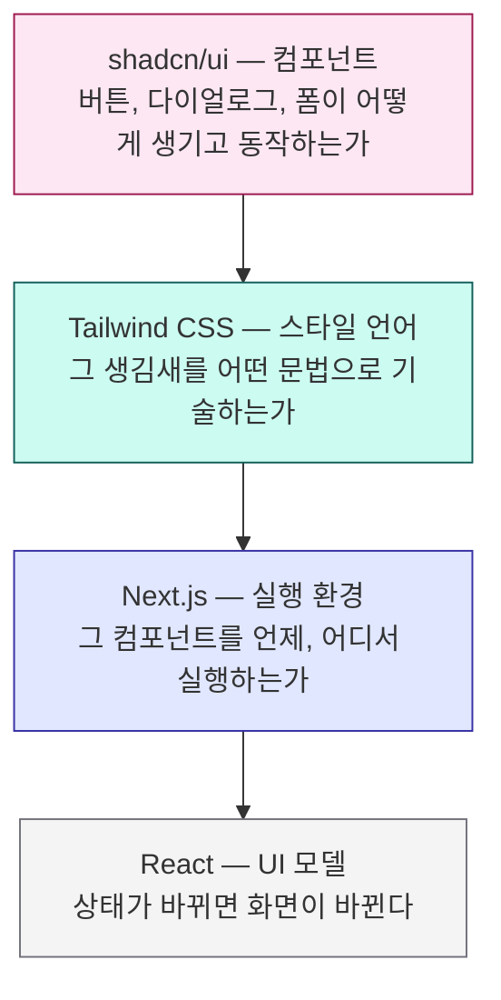
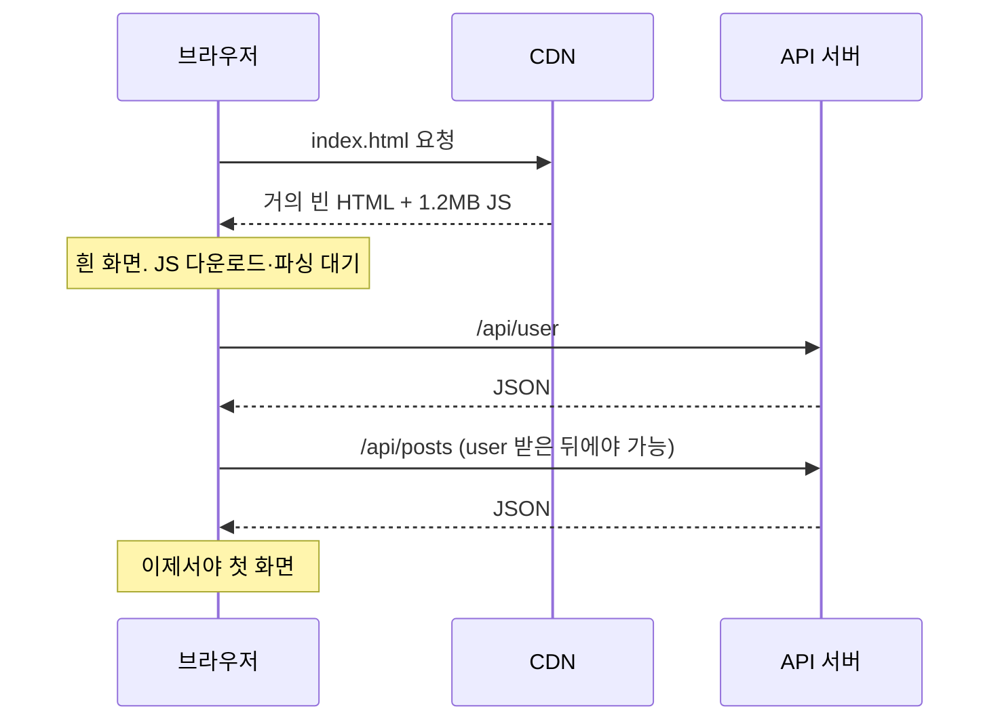

# 1. 지형도

세 도구는 각각 무슨 문제를 풀고 있는가

---

## 먼저: 이 셋은 경쟁하지 않는다

초심자가 가장 많이 하는 오해가 "Next.js vs Tailwind vs shadcn 중에 뭘 골라야 하나"다.
셋은 **완전히 다른 층**에 있다.



각 층은 아래 층을 **전제**하지 대체하지 않는다.

---

## 한 문장씩

<v-clicks>

**React** — "상태가 바뀌면 화면을 다시 그린다"는 규칙 하나로 UI를 함수로 만든다.

**Next.js** — 그 React 컴포넌트를 **서버에서도 실행**하고, 라우팅·번들링·캐싱·배포까지 묶어준다.

**Tailwind CSS** — CSS를 **클래스 이름을 새로 짓지 않고** HTML 안에서 직접 조립한다.

**shadcn/ui** — 그 Tailwind로 스타일링된 접근성 있는 컴포넌트 **소스코드를 내 레포에 복사**해 준다.

</v-clicks>

<v-click>

<div class="pt-4 text-lg">
정리하면: <strong>Next.js가 실행하고, Tailwind가 기술하고, shadcn/ui가 출발점을 준다.</strong>
</div>

</v-click>

---

## 각각이 없던 시절의 고통 (1) — Next.js 이전



<v-clicks>

- **번들이 크다** — 화면에 안 보이는 코드까지 전부 브라우저로 간다
- **워터폴** — 컴포넌트가 렌더돼야 fetch가 시작되고, 그 결과로 또 fetch한다
- **SEO** — 크롤러가 받은 HTML에는 내용이 없다

</v-clicks>

---

## 각각이 없던 시절의 고통 (2) — Tailwind 이전

```css
/* 이 클래스 이름을 뭐라고 지을 것인가로 30분 */
.card { }
.card__header { }
.card__header--highlighted { }
.card__header--highlighted-compact { }   /* 여기서부터 무너진다 */
```

<v-clicks>

- **이름 짓기가 병목** — BEM, OOCSS, SMACSS… 방법론 논쟁이 10년 넘게 이어졌다
- **삭제가 불가능** — 이 클래스를 지워도 되는지 아무도 확신하지 못해 CSS 파일은 계속 커진다
- **전역 네임스페이스** — 어딘가의 `.title`이 내 `.title`을 덮어쓴다
- **파일 왕복** — 마크업 고치고, CSS 파일 열고, 다시 마크업으로

</v-clicks>

---

## 각각이 없던 시절의 고통 (3) — shadcn/ui 이전

전통적인 컴포넌트 라이브러리(MUI, Ant Design, Chakra)는 `node_modules`에 들어온다.

<v-clicks>

- 처음엔 빠르다. **디자인이 라이브러리와 다른 순간** 문제가 시작된다
- 커스터마이징은 라이브러리가 **허락한 만큼만** 가능하다 (`sx`, `theme.overrides`, `!important`)
- 라이브러리 v5 → v6 업그레이드가 **전사 프로젝트급 작업**이 된다
- 결국 "라이브러리를 감싸는 우리 래퍼"를 만들고, 래퍼가 또 부채가 된다

</v-clicks>

<v-click>

<div class="pt-3 text-lg">
근본 원인 하나: <strong>내가 쓰는 코드를 내가 소유하지 않았다.</strong>
</div>

</v-click>

---

## 왜 하필 이 조합인가

<div class="grid grid-cols-2 gap-6 pt-2">
<div>

**궁합이 맞는 지점**

- shadcn/ui는 **Tailwind로 스타일링**되어 있다. 다른 스타일 시스템을 쓰면 이점이 절반으로 준다
- Tailwind는 빌드 타임에 클래스를 스캔한다. Next.js 빌드 파이프라인에 그대로 얹힌다
- shadcn 컴포넌트는 **RSC를 전제**로 만들어져 있다 (`use client`가 필요한 것만 붙어 있다)

</div>
<div>

**결과**

- `pnpm dlx shadcn@latest add button` 한 줄이면 끝
- 디자인 변경 = 내 레포의 파일 수정
- 토큰 하나 바꾸면 앱 전체가 따라 바뀐다

</div>
</div>

<v-click>

<div class="pt-4">
이 셋은 <strong>같은 사람들이 같은 시기에 같은 문제의식으로</strong> 만든 게 아닌데도
유독 잘 맞는다. 공통점은 "추상화를 얇게 유지한다"는 태도다.
</div>

</v-click>

---

## 이 조합이 정답이 아닌 경우

<v-clicks>

- **디자인 시스템이 이미 완성돼 있고 웹 컴포넌트로 배포 중** → 그걸 쓰는 게 맞다
- **사내 표준이 Vue/Angular** → Next.js가 아니라 Nuxt/Analog. (Tailwind와 shadcn 포팅본은 있다)
- **관리자 화면만 빠르게** → 데이터 그리드가 완성품으로 있는 MUI/AG Grid가 더 빠를 수 있다
- **정적 문서 사이트** → Astro나 VitePress가 더 가볍다
- **팀에 React 경험자가 없다** → 학습 곡선 세 개를 동시에 오르게 된다

</v-clicks>

<v-click>

<div class="pt-3">
반대로 <strong>제품을 오래 만들 예정이고 디자인이 계속 바뀔 것</strong>이라면
이 조합의 이점이 가장 크게 나타난다.
</div>

</v-click>

---

## 대안 지도

| 층 | 이 덱의 선택 | 주요 대안 | 언제 대안이 낫나 |
|---|---|---|---|
| 메타 프레임워크 | Next.js | Remix/React Router, TanStack Start, Astro | 서버 중심 폼 / 콘텐츠 사이트 |
| 스타일 | Tailwind | CSS Modules, Panda CSS, vanilla-extract | 런타임 zero + 타입 안전 CSS가 최우선 |
| 컴포넌트 | shadcn/ui | MUI, Ant Design, Mantine, Chakra | 완성된 복합 위젯이 당장 필요 |
| 프리미티브 | Base UI | Radix, React Aria, Headless UI | 이미 쓰고 있는 것이 있음 |

<div class="pt-2 text-sm opacity-70">
Panda CSS와 vanilla-extract는 Tailwind와 철학이 비슷하지만 타입 안전성을 더 중시한다.
빌드 복잡도가 올라가는 대신 CSS 값에 타입이 붙는다.
</div>

---

## 실행 위치라는 축

이 덱 전체를 관통하는 질문 하나를 미리 심어둔다.

<div class="text-2xl py-6 leading-relaxed">
이 코드는 <strong>어디서 실행되는가?</strong><br>
빌드 타임 / 서버 요청 시 / 브라우저
</div>

<v-clicks>

- Tailwind의 클래스 스캔 → **빌드 타임**
- 서버 컴포넌트의 DB 쿼리 → **서버 요청 시**
- `useState`로 열리는 드롭다운 → **브라우저**

</v-clicks>

<v-click>

Next.js를 어렵게 느끼는 이유의 90%는 이 세 가지가 한 파일에 섞여 보이기 때문이다.

</v-click>

---

## 완성된 화면 미리보기

이 덱을 마치면 아래 화면을 **직접 만들고, 토큰만 바꿔 다시 칠할 수 있게** 된다.

<GalleryDemo />

<div class="pt-2 text-sm opacity-70">
Tabs · Input · Button · Table · Avatar · Badge · Alert — 전부 shadcn/ui의 기본 컴포넌트다.
</div>

---

## 같은 화면, 다른 디자인 시스템

그리고 이렇게 바꾸는 데 필요한 건 **CSS 변수 몇 줄**이다. 컴포넌트 코드는 한 글자도 안 바뀐다.

<ThemeCompare :themes="['shadcn', 'material', 'corporate']" />

<div class="pt-3 text-sm opacity-70">
17장에서 이 작업을 처음부터 끝까지 한다.
</div>

---

## 1장 요약

<v-clicks>

- 세 도구는 **다른 층**에 있다 — 컴포넌트 / 스타일 언어 / 실행 환경
- 각각은 실제로 아팠던 문제에서 나왔다 — 번들과 워터폴 / 이름 짓기 / 소유권 없음
- 조합의 핵심은 **추상화를 얇게 유지**한다는 공통 태도
- 정답은 아니다. 디자인이 자주 바뀌는 장기 제품에서 이점이 가장 크다
- 앞으로 계속 물을 질문: **"이 코드는 어디서 실행되는가?"**

</v-clicks>
