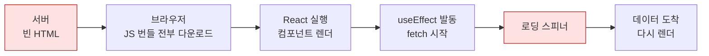
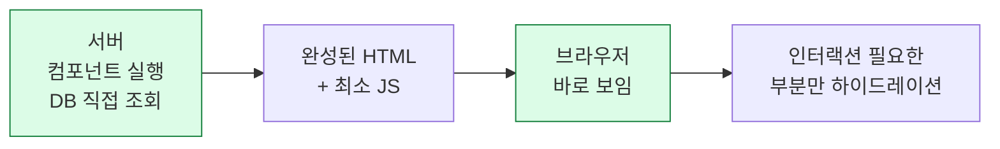
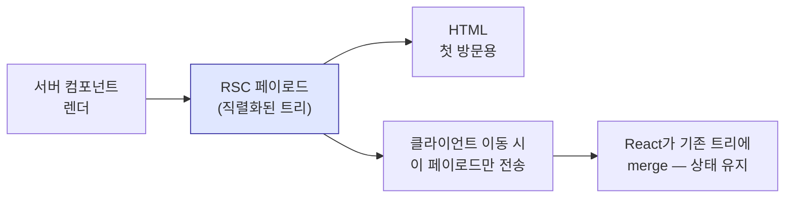

# 2. Next.js의 실체

서버 컴포넌트라는 전환

---

## Next.js를 한 문장으로

<div class="text-2xl py-8 leading-relaxed">
React 컴포넌트를 <strong>서버에서도 실행할 수 있게</strong> 만들고,<br>
그에 필요한 라우팅·번들링·캐싱·배포를 한 덩어리로 묶은 것.
</div>

<v-clicks>

- "서버에서도"가 핵심이다. 나머지는 그걸 실용적으로 만들기 위한 부속이다
- 이 전환이 App Router(Next.js 13)에서 시작해 지금(16.x)까지 다듬어지고 있다
- Pages Router는 여전히 동작하지만, 새 프로젝트의 기본은 App Router다

</v-clicks>

---

## 기존 React 앱에서 벌어지던 일



<v-clicks>

- 사용자는 **흰 화면 → 스켈레톤 → 실제 내용** 세 단계를 본다
- 데이터를 가져오는 코드가 브라우저에 있으니 **API 서버가 따로 필요**하다
- API 키를 브라우저에 둘 수 없으니 **또 다른 서버**를 만든다

</v-clicks>

---

## 서버 컴포넌트가 바꾸는 것



<v-clicks>

- 데이터 조회가 **컴포넌트 안에서** 일어난다. `await db.query(...)`를 바로 쓴다
- 그 코드는 **브라우저로 전송되지 않는다**. 번들에 포함조차 안 된다
- API 레이어가 사라진다. 화면이 곧 자기 데이터를 안다

</v-clicks>

---

## 서버 컴포넌트 = 기본값

App Router에서는 **아무 표시가 없으면 서버 컴포넌트**다.

```tsx
// app/posts/page.tsx — 표시 없음 = 서버 컴포넌트
import { db } from '@/lib/db'

export default async function PostsPage() {
  // 이 쿼리는 서버에서만 실행된다. 브라우저는 이 코드를 본 적도 없다.
  const posts = await db.post.findMany({ orderBy: { createdAt: 'desc' } })

  return (
    <ul>
      {posts.map((p) => (
        <li key={p.id}>{p.title}</li>
      ))}
    </ul>
  )
}
```

<v-click>

`async` 컴포넌트가 자연스럽게 동작한다. 이건 **서버 컴포넌트만의 특권**이다.

</v-click>

---

## 클라이언트 컴포넌트는 명시적으로

```tsx {1|3-4|7-12|all}
'use client'   // ← 이 파일부터는 브라우저로 간다

import { useState } from 'react'
import { Button } from '@/components/ui/button'

export function Counter() {
  const [n, setN] = useState(0)
  return (
    <Button onClick={() => setN(n + 1)}>
      눌린 횟수: {n}
    </Button>
  )
}
```

<v-click>

`useState`, `useEffect`, `onClick`, `window`, `localStorage` —
**브라우저가 필요한 것을 쓰면 `use client`가 필요하다.**

</v-click>

---

## `use client`는 "경계"지 "스위치"가 아니다

가장 흔한 오해다. `use client`는 그 파일 하나가 아니라 **거기서부터 아래 전부**를 클라이언트로 만든다.

<div class="tree pt-4">
<span class="server">app/page.tsx</span> — 서버<br>
&nbsp;&nbsp;├─ <span class="server">&lt;Header /&gt;</span> — 서버<br>
&nbsp;&nbsp;├─ <span class="client">&lt;SearchBox /&gt;</span> — 'use client' ← 여기가 <strong>경계</strong><br>
&nbsp;&nbsp;│&nbsp;&nbsp;&nbsp;└─ <span class="client">&lt;Suggestions /&gt;</span> — 표시 없어도 <strong>클라이언트</strong><br>
&nbsp;&nbsp;│&nbsp;&nbsp;&nbsp;&nbsp;&nbsp;&nbsp;&nbsp;└─ <span class="client">&lt;Highlight /&gt;</span> — 역시 클라이언트<br>
&nbsp;&nbsp;└─ <span class="server">&lt;PostList /&gt;</span> — 서버
</div>

<v-click>

<div class="pt-4">
그래서 <code>use client</code>를 <strong>트리 위쪽에 두면</strong> 앱 대부분이 클라이언트가 된다.
레이아웃 최상단에 무심코 붙이는 것이 가장 흔한 사고다.
</div>

</v-click>

---

## 번들에 미치는 영향

같은 대시보드 화면을 세 가지 방식으로 구성했을 때 브라우저로 가는 JS 크기.

<BarChart
  :items="[['전부 클라이언트 컴포넌트', 187, '187 kB'], ['경계를 잘못 그음 (레이아웃에 use client)', 164, '164 kB'], ['잎사귀에만 use client', 41, '41 kB']]"
  :highlight="2"
/>

<div class="pt-4 text-sm opacity-70">
숫자는 예시지만 비율은 실제 프로젝트에서 흔히 나타나는 수준이다.
차트 라이브러리·에디터·날짜 피커처럼 무거운 의존성이 클라이언트 쪽에 딸려오면 차이가 더 벌어진다.
</div>

---

## 규칙: 경계를 잎사귀로 밀어라

<div class="grid grid-cols-2 gap-6 pt-2">
<div>

**나쁜 배치**

```tsx
'use client'
export default function Layout({ children }) {
  const [open, setOpen] = useState(false)
  return (
    <div>
      <Sidebar open={open} />
      <button onClick={() => setOpen(!open)}>메뉴</button>
      {children}
    </div>
  )
}
```

`children` 안의 모든 게 딸려간다.

</div>
<div>

**좋은 배치**

```tsx
// 레이아웃은 서버 컴포넌트로 둔다
export default function Layout({ children }) {
  return (
    <div>
      <SidebarToggle />  {/* 여기만 클라이언트 */}
      {children}
    </div>
  )
}
```

상태를 가진 **작은 조각만** 분리한다.

</div>
</div>

---

## 서버 컴포넌트가 클라이언트 컴포넌트를 감쌀 수 있다

반대로도 되는지가 헷갈리는 지점이다. 정답: **`children`으로 넘기면 된다.**

```tsx {1-8|10-18|all}
// ❌ 클라이언트 컴포넌트가 서버 컴포넌트를 직접 import — 불가능
'use client'
import { ServerPostList } from './post-list'  // 서버 컴포넌트

export function Panel() {
  return <div><ServerPostList /></div>   // 클라이언트로 끌려들어간다
}

// ✅ children으로 받으면 된다
'use client'
export function Panel({ children }) {
  const [open, setOpen] = useState(true)
  return <div>{open && children}</div>
}

// 서버 컴포넌트(page.tsx)에서 조립
<Panel>
  <ServerPostList />   {/* 서버에서 렌더된 결과가 들어간다 */}
</Panel>
```

---

## 서버에서 클라이언트로 넘길 수 있는 것

경계를 넘는 props는 **직렬화**되어야 한다. 이게 실무에서 가장 자주 부딪히는 제약이다.

<div class="grid grid-cols-2 gap-6 pt-2">
<div>

**가능**

- 문자열, 숫자, 불리언, `null`
- 배열, 평범한 객체
- `Date`, `Map`, `Set`
- Promise (React가 처리해 준다)
- JSX (`children` 포함)
- Server Function 참조

</div>
<div>

**불가능**

- 함수 (`onClick={handleClick}`)
- 클래스 인스턴스 (ORM 모델 객체 등)
- `Symbol`
- 클로저를 가진 무엇이든

</div>
</div>

<v-click>

<div class="pt-3 text-sm">
ORM이 돌려준 객체를 그대로 넘기다 터지는 일이 흔하다. <code>select</code>로 필요한 필드만 뽑거나
평범한 객체로 변환해서 넘긴다.
</div>

</v-click>

---

## 서버에서 클라이언트로 가는 것의 정체 — RSC 페이로드

<div class="text-lg py-2">
서버 컴포넌트의 렌더 결과는 HTML만이 아니다. <strong>RSC 페이로드</strong>라는 별도 형식도 함께 간다.
</div>



<v-clicks>

- 첫 방문 → HTML을 받아 즉시 보인다
- 링크 클릭 → 전체 페이지가 아니라 **RSC 페이로드만** 받는다
- 그래서 클라이언트 상태(스크롤, 입력값, 열린 모달)가 **유지된 채** 화면이 바뀐다

</v-clicks>

---

## 하이드레이션이란 무엇인가

<v-clicks>

1. 서버가 HTML을 보낸다 → 사용자에게 **보인다**. 하지만 버튼을 눌러도 반응이 없다
2. 클라이언트 컴포넌트의 JS가 도착한다
3. React가 그 HTML에 이벤트 핸들러를 붙인다 → **이제 동작한다**

</v-clicks>

<v-click>

<div class="pt-4">
이 2~3단계 사이의 간극이 짧을수록 좋은 앱이다.
<strong>서버 컴포넌트를 많이 쓸수록 하이드레이션할 대상이 줄어든다.</strong>
</div>

</v-click>

<v-click>

<div class="pt-3 text-sm opacity-70">
서버와 클라이언트의 첫 렌더 결과가 다르면 "hydration mismatch" 에러가 난다.
<code>new Date()</code>, <code>Math.random()</code>, <code>window</code> 분기가 단골 원인이다.
</div>

</v-click>

---

## 서버 컴포넌트에서 못 하는 것

<v-clicks>

- `useState`, `useReducer`, `useEffect` 등 **모든 훅**
- `onClick`, `onChange` 등 **이벤트 핸들러**
- `window`, `document`, `localStorage`
- Context를 **제공**하는 것 (`<Provider>`는 클라이언트 컴포넌트여야 한다)

</v-clicks>

<v-click>

<div class="pt-4">
반대로 <strong>클라이언트 컴포넌트에서 못 하는 것</strong>:
</div>

- `async` 컴포넌트 (`export default async function`)
- DB 직접 접근, 파일 시스템, 비밀 환경변수
- Node.js 전용 모듈

</v-click>

---

## 2장 요약

<v-clicks>

- Next.js의 본질은 **React를 서버에서 실행하는 것**이다
- App Router에서 **서버 컴포넌트가 기본값**, 클라이언트는 `use client`로 명시
- `use client`는 스위치가 아니라 **경계**다. 아래 전부가 클라이언트가 된다
- 경계를 **잎사귀로 밀수록** 번들이 작아진다
- 클라이언트가 서버 컴포넌트를 쓰려면 **`children`으로 받는다**
- 경계를 넘는 props는 **직렬화 가능**해야 한다

</v-clicks>
