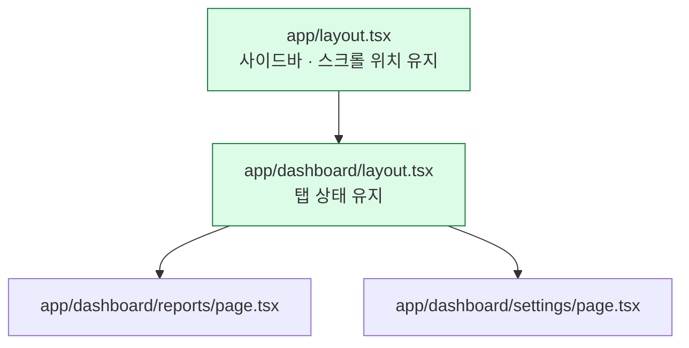

# 3. App Router

폴더가 곧 URL이다

---

## 파일 규약이라는 아이디어

Next.js는 설정 파일 대신 **폴더 구조와 파일 이름**으로 라우팅을 정의한다.

```text
app/
├─ layout.tsx          → 모든 페이지를 감싸는 껍데기 (필수)
├─ page.tsx            → /
├─ loading.tsx         → 로딩 중 보여줄 UI
├─ error.tsx           → 에러 경계
├─ not-found.tsx       → 404
├─ posts/
│  ├─ page.tsx         → /posts
│  └─ [slug]/
│     └─ page.tsx      → /posts/hello-world
└─ (marketing)/        → URL에 안 나타나는 그룹
   └─ about/page.tsx   → /about
```

<v-click>

**폴더는 경로를 만들고, `page.tsx`가 있어야 실제로 접근 가능해진다.**
`page.tsx` 없는 폴더는 URL이 되지 않는다.

</v-click>

---

## 특수 파일 전체 목록

| 파일 | 역할 |
|---|---|
| `layout.tsx` | 자식 라우트를 감싸는 공유 UI. **이동해도 리렌더되지 않는다** |
| `page.tsx` | 해당 경로의 실제 화면. 이게 있어야 URL이 생긴다 |
| `loading.tsx` | 자동으로 Suspense 경계를 만들어 준다 |
| `error.tsx` | 자동으로 에러 경계를 만든다. **클라이언트 컴포넌트여야 한다** |
| `not-found.tsx` | `notFound()` 호출 또는 매칭 실패 시 |
| `template.tsx` | layout과 비슷하지만 **이동할 때마다 새로 마운트**된다 |
| `route.ts` | 페이지 대신 HTTP 핸들러 (REST API) |
| `default.tsx` | 병렬 라우트에서 매칭 실패 시 대체 UI |

---

## layout은 리렌더되지 않는다

이 성질이 App Router의 중요한 장점인데 잘 알려져 있지 않다.



<v-clicks>

- `/dashboard/reports` → `/dashboard/settings` 이동 시 **바뀌는 건 page뿐**
- 사이드바의 스크롤 위치, 열린 아코디언, 재생 중인 오디오가 그대로 살아 있다
- 그래서 "레이아웃에 상태를 두어도 안전"하다

</v-clicks>

---

## 동적 세그먼트

```text
app/posts/[slug]/page.tsx        → /posts/abc          params.slug = 'abc'
app/shop/[...cat]/page.tsx       → /shop/a/b/c         params.cat = ['a','b','c']
app/docs/[[...path]]/page.tsx    → /docs 또는 /docs/a  (optional catch-all)
```

```tsx {1-8|10-16}
// params는 Promise다 — Next.js 15부터 바뀌었다. await 해야 한다.
export default async function PostPage({ params }: PageProps<'/posts/[slug]'>) {
  const { slug } = await params
  const post = await getPost(slug)
  if (!post) notFound()
  return <article>{post.title}</article>
}

// 빌드 타임에 미리 생성할 경로를 알려준다
export async function generateStaticParams() {
  const posts = await getAllPosts()
  return posts.map((p) => ({ slug: p.slug }))
}
```

<v-click>

`PageProps<'/posts/[slug]'>`는 Next.js가 **자동 생성해 주는 타입**이다. 직접 정의할 필요가 없다.

</v-click>

---

## searchParams도 Promise다

```tsx
export default async function SearchPage({
  searchParams,
}: PageProps<'/search'>) {
  const { q, page } = await searchParams
  const results = await search(q, Number(page ?? 1))
  return <ResultList items={results} />
}
```

<v-clicks>

- `params`와 `searchParams`가 Promise가 된 이유는 **부분 프리렌더링** 때문이다
- 이 값을 `await`하기 전까지는 페이지의 나머지 부분을 미리 만들어 둘 수 있다
- 6장에서 이 설계의 의미를 자세히 다룬다

</v-clicks>

---

## 라우트 그룹 — 괄호 폴더

괄호로 감싼 폴더는 **URL에 나타나지 않는다.** 레이아웃을 나눌 때 쓴다.

```text
app/
├─ (marketing)/
│  ├─ layout.tsx        → 마케팅용 헤더/푸터
│  ├─ page.tsx          → /
│  └─ pricing/page.tsx  → /pricing
└─ (app)/
   ├─ layout.tsx        → 앱용 사이드바 (로그인 필요)
   ├─ dashboard/page.tsx → /dashboard
   └─ settings/page.tsx  → /settings
```

<v-click>

랜딩 페이지와 로그인 후 화면의 껍데기가 완전히 다른 경우가 대부분이다.
**이 구조가 사실상 표준 패턴**이라고 봐도 된다.

</v-click>

---

## 병렬 라우트와 인터셉트

이름은 어렵지만 용도는 명확하다.

<div class="grid grid-cols-2 gap-6 pt-2">
<div>

**병렬 라우트 — `@slot`**

```text
app/dashboard/
├─ layout.tsx
├─ @team/page.tsx
├─ @analytics/page.tsx
└─ page.tsx
```

```tsx
export default function Layout({
  children, team, analytics,
}) {
  return <>{children}{team}{analytics}</>
}
```

한 화면에 독립적인 영역 여러 개.
각각 자기 loading/error를 가진다.

</div>
<div>

**인터셉트 — `(.)`**

```text
app/
├─ feed/page.tsx
├─ photo/[id]/page.tsx
└─ feed/(.)photo/[id]/page.tsx
```

피드에서 사진을 클릭하면 **모달**로 뜨고,
URL을 직접 열면 **전체 페이지**로 뜬다.

인스타그램의 그 동작이다.

</div>
</div>

---

## Route Handler — 진짜 API가 필요할 때

```ts {1-7|9-13}
// app/api/posts/route.ts
export async function GET(request: Request) {
  const { searchParams } = new URL(request.url)
  const limit = Number(searchParams.get('limit') ?? 10)
  const posts = await db.post.findMany({ take: limit })
  return Response.json(posts)
}

export async function POST(request: Request) {
  const body = await request.json()
  const created = await db.post.create({ data: body })
  return Response.json(created, { status: 201 })
}
```

<v-click>

<div class="pt-2">
<strong>주의: 화면에 데이터를 뿌리려고 Route Handler를 만들지 말 것.</strong>
서버 컴포넌트에서 DB를 직접 부르면 된다. Route Handler는
외부에서 호출하는 진짜 API(웹훅, 서드파티 연동, 모바일 앱)에만 쓴다.
</div>

</v-click>

---

## 링크와 내비게이션

```tsx {1-6|8-16}
import Link from 'next/link'

// 기본 — 뷰포트에 들어오면 자동으로 프리페치된다
<Link href="/posts/hello">읽기</Link>
<Link href="/posts/hello" prefetch={false}>프리페치 끄기</Link>

// 프로그래매틱 이동은 클라이언트 컴포넌트에서
'use client'
import { useRouter } from 'next/navigation'

export function SaveButton() {
  const router = useRouter()
  return <button onClick={() => router.push('/done')}>저장</button>
}
```

<v-click>

`next/router`가 아니라 **`next/navigation`**이다. Pages Router 시절 코드를 그대로 가져오면 안 된다.

</v-click>

---

## 로딩과 에러 — 파일만 두면 된다

<div class="grid grid-cols-2 gap-6 pt-2">
<div>

```tsx
// app/posts/loading.tsx
export default function Loading() {
  return <PostListSkeleton />
}
```

이 파일이 있으면 Next.js가 `page.tsx`를
자동으로 Suspense로 감싼다.

</div>
<div>

```tsx
// app/posts/error.tsx
'use client'   // 필수

export default function Error({
  error, reset,
}: {
  error: Error
  reset: () => void
}) {
  return (
    <div>
      <p>불러오지 못했습니다</p>
      <button onClick={reset}>다시 시도</button>
    </div>
  )
}
```

</div>
</div>

<v-click>

<div class="pt-2 text-sm opacity-70">
<code>error.tsx</code>는 <strong>같은 폴더의 layout에서 난 에러는 못 잡는다.</strong>
그건 상위 폴더의 <code>error.tsx</code>가 잡는다. 최상위는 <code>global-error.tsx</code>.
</div>

</v-click>

---

## proxy.ts — 예전의 middleware.ts

<div class="text-lg py-2">
Next.js 16에서 <code>middleware.ts</code>가 <strong><code>proxy.ts</code>로 이름이 바뀌었다.</strong>
런타임 기본값도 Edge에서 <strong>Node.js</strong>로 바뀌었다.
</div>

```ts
// proxy.ts (프로젝트 루트, app/ 과 같은 레벨)
import { NextResponse } from 'next/server'
import type { NextRequest } from 'next/server'

export function proxy(request: NextRequest) {
  if (!request.cookies.get('session')) {
    return NextResponse.redirect(new URL('/login', request.url))
  }
}

export const config = {
  matcher: ['/((?!api|_next/static|_next/image|favicon.ico).*)'],
}
```

```bash
npx @next/codemod@canary middleware-to-proxy .   # 자동 마이그레이션
```

---

## proxy를 인증 게이트로 믿지 말 것

Next.js 팀이 문서에서 명시적으로 경고하는 지점이다.

<v-clicks>

- 이름을 "proxy"로 바꾼 이유 자체가 **"최후의 수단으로만 쓰라"**는 신호다
- Express 미들웨어와 혼동해 인증 로직 전체를 여기 넣는 사례가 많았다
- **Server Function은 별도 라우트가 아니다.** matcher가 그 경로를 제외하면 함께 빠진다
- matcher를 리팩터링하다 인증이 조용히 사라지는 사고가 실제로 발생한다

</v-clicks>

<v-click>

<div class="pt-3 text-lg">
<strong>인증·인가는 데이터에 닿는 지점마다 확인한다.</strong>
proxy는 "빠른 리다이렉트" 정도의 최적화로만 쓴다.
</div>

</v-click>

---

## 3장 요약

<v-clicks>

- 폴더가 URL이고, `page.tsx`가 있어야 접근 가능해진다
- **layout은 이동해도 리렌더되지 않는다** — 상태를 두어도 안전하다
- `params` / `searchParams`는 **Promise**다. `await`한다
- 라우트 그룹으로 껍데기를 분리하는 게 표준 패턴
- 화면용 데이터에 Route Handler를 만들지 말 것 — 서버 컴포넌트에서 직접 조회
- `middleware.ts` → **`proxy.ts`**. 인증의 최종 방어선으로 쓰지 말 것

</v-clicks>
