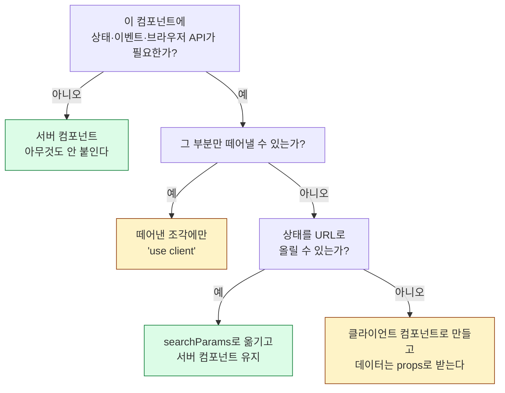

# 4. 경계 설계

`use client`를 어디에 둘 것인가

---

## 이 장에서 답할 질문

<div class="text-xl py-4 leading-relaxed">
서버 컴포넌트가 기본값이라는 건 알겠다.<br>
그런데 <strong>Provider는? 서드파티 라이브러리는? Context는?</strong>
</div>

<v-clicks>

- 이 장은 실무에서 반드시 부딪히는 **다섯 가지 상황**과 각각의 정석 패턴을 다룬다
- 원칙은 하나다: **경계를 아래로, 작게**

</v-clicks>

---

## 상황 1: Provider가 필요하다

테마, 쿼리 클라이언트, 세션… Provider는 Context를 쓰므로 **반드시 클라이언트 컴포넌트**다.
그런데 앱 최상단에 필요하다. 그럼 앱 전체가 클라이언트가 되나?

<div class="grid grid-cols-2 gap-6 pt-3">
<div>

```tsx
// app/providers.tsx
'use client'

import { ThemeProvider } from 'next-themes'

export function Providers({
  children,
}: {
  children: React.ReactNode
}) {
  return <ThemeProvider>{children}</ThemeProvider>
}
```

</div>
<div>

```tsx
// app/layout.tsx — 서버 컴포넌트로 유지!
import { Providers } from './providers'

export default function RootLayout({
  children,
}) {
  return (
    <html>
      <body>
        <Providers>{children}</Providers>
      </body>
    </html>
  )
}
```

</div>
</div>

<v-click>

**아니다.** `children`으로 받으면 그 내용은 여전히 서버에서 렌더된다.
Provider는 껍데기일 뿐이고, 안쪽은 서버 컴포넌트 그대로다.

</v-click>

---

## 도넛 패턴

이 구조를 도넛(donut)이라고 부른다. **테두리만 클라이언트, 구멍은 서버.**

<div class="tree pt-4">
<span class="client">&lt;Providers&gt;</span> — 클라이언트 (테두리)<br>
&nbsp;&nbsp;<span class="server">&lt;Dashboard /&gt;</span> — 서버 (구멍)<br>
&nbsp;&nbsp;&nbsp;&nbsp;<span class="server">&lt;RevenueChart /&gt;</span> — 서버<br>
&nbsp;&nbsp;&nbsp;&nbsp;<span class="client">&lt;DateRangePicker /&gt;</span> — 클라이언트<br>
<span class="client">&lt;/Providers&gt;</span>
</div>

<v-click>

<div class="pt-4">
핵심은 <strong>"클라이언트 컴포넌트가 서버 컴포넌트를 import하면 안 된다"</strong>는 것이지
<strong>"감싸면 안 된다"</strong>가 아니라는 점이다.
</div>

</v-click>

<v-click>

<div class="pt-2 text-sm opacity-70">
import는 번들러가 정적으로 따라가지만, children으로 넘긴 JSX는 이미 렌더된 결과다.
그래서 서버에 남을 수 있다.
</div>

</v-click>

---

## 상황 2: 서드파티 라이브러리에 `use client`가 없다

```tsx
// ❌ 서버 컴포넌트에서 바로 쓰면 터진다
import { Carousel } from 'some-old-carousel'

export default function Page() {
  return <Carousel />   // 내부에서 useState를 쓰는데 'use client'가 없음
}
```

```tsx
// ✅ 내 쪽에서 감싸서 경계를 만들어 준다
// components/carousel.tsx
'use client'
export { Carousel } from 'some-old-carousel'
```

<v-click>

<div class="pt-2">
한 줄짜리 re-export 파일이면 충분하다.
잘 관리되는 라이브러리는 이미 <code>use client</code>를 넣어 배포하지만,
오래된 것들은 직접 감싸야 한다.
</div>

</v-click>

---

## 상황 3: 클라이언트 컴포넌트에 데이터가 필요하다

```tsx {1-13|15-24}
// 방법 A — 서버에서 조회해 props로 내려준다 (기본 선택지)
// app/page.tsx (서버)
export default async function Page() {
  const user = await getUser()
  return <ProfileEditor user={user} />
}

// components/profile-editor.tsx
'use client'
export function ProfileEditor({ user }: { user: User }) {
  const [name, setName] = useState(user.name)
  // ...
}

// 방법 B — Promise를 넘기고 use()로 읽는다 (스트리밍 가능)
export default function Page() {
  const userPromise = getUser()      // await하지 않는다
  return <ProfileEditor userPromise={userPromise} />
}

'use client'
import { use } from 'react'
export function ProfileEditor({ userPromise }) {
  const user = use(userPromise)      // Suspense와 함께 동작
}
```

---

## 상황 4: Context를 쓰고 싶다

<div class="text-lg py-2">
결론부터: <strong>서버 컴포넌트 트리에서는 Context를 쓸 수 없다.</strong> 대안이 대부분 더 낫다.
</div>

| 쓰고 싶었던 것 | 서버 우선 대안 |
|---|---|
| 현재 사용자 정보 | 서버에서 `getUser()` 호출. `React.cache()`로 중복 제거 |
| 테마 | CSS 변수 + 쿠키. Provider는 토글 버튼만 감싼다 |
| 필터·정렬 상태 | **URL의 searchParams**. 공유·뒤로가기가 공짜로 따라온다 |
| 폼 상태 | 폼 컴포넌트 안에 지역 상태로 |
| 장바구니 | 클라이언트 Provider가 맞다 (진짜 전역 클라이언트 상태) |

<v-click>

<div class="pt-2 text-sm opacity-70">
<code>React.cache()</code>로 감싼 함수는 <strong>한 요청 안에서</strong> 같은 인자에 대해 한 번만 실행된다.
서버 컴포넌트 여러 곳에서 <code>getUser()</code>를 불러도 DB 조회는 한 번이다.
</div>

</v-click>

---

## 상태를 URL로 올리기

의외로 많은 클라이언트 상태가 **사실 URL에 있어야 할 것**이다.

<div class="grid grid-cols-2 gap-6 pt-2">
<div>

```tsx
// ❌ useState로 관리
'use client'
const [sort, setSort] = useState('new')
const [page, setPage] = useState(1)
// 새로고침하면 날아감
// 링크 공유 불가
// 뒤로가기 동작 안 함
```

</div>
<div>

```tsx
// ✅ URL이 상태
// app/posts/page.tsx (서버)
export default async function Page({
  searchParams,
}: PageProps<'/posts'>) {
  const { sort = 'new', page = '1' } =
    await searchParams
  const posts = await getPosts(sort, +page)
  return <PostList posts={posts} />
}
```

</div>
</div>

<v-click>

<div class="pt-3">
이렇게 하면 목록 컴포넌트가 <strong>서버 컴포넌트로 남는다.</strong>
정렬 버튼만 클라이언트로 만들어 <code>router.push</code>하면 된다.
</div>

</v-click>

---

## 상황 5: 서버 전용 코드를 지키고 싶다

가장 무서운 사고는 **비밀 키가 브라우저 번들에 섞여 들어가는 것**이다.

```ts {1-9|11-14}
// lib/data.ts
import 'server-only'   // 클라이언트에서 import하면 빌드가 실패한다

export async function getSecretData() {
  const res = await fetch('https://api.internal', {
    headers: { Authorization: `Bearer ${process.env.API_SECRET}` },
  })
  return res.json()
}

// 반대 방향도 있다
// lib/browser-utils.ts
import 'client-only'   // 서버에서 import하면 빌드가 실패한다
export const getLocalDraft = () => localStorage.getItem('draft')
```

<v-click>

<div class="pt-2">
<code>NEXT_PUBLIC_</code> 접두사가 붙은 환경변수만 브라우저로 간다.
나머지는 서버 전용이지만, <strong>실수로 클라이언트 컴포넌트에서 참조하면 조용히 undefined가 될 뿐이다.</strong>
<code>server-only</code>가 그 실수를 빌드 타임에 잡아준다.
</div>

</v-click>

---

## 결정 트리



---

## 자주 하는 실수 모음

<v-clicks>

- **레이아웃 최상단에 `use client`** — 앱 전체가 클라이언트가 된다. 가장 흔한 사고
- **함수를 props로 넘김** — `onSubmit={handleSubmit}`은 경계를 못 넘는다
- **ORM 객체를 그대로 전달** — 직렬화 실패. 평범한 객체로 변환할 것
- **`use client` 파일에서 `async` 컴포넌트** — 지원되지 않는다
- **`error.tsx`에 `use client`를 안 붙임** — 반드시 클라이언트 컴포넌트여야 한다
- **서버 컴포넌트에서 `window` 접근** — `typeof window` 분기는 냄새다. 경계를 잘못 그은 것

</v-clicks>

---

## 파일 구조 관례

```text
app/
├─ layout.tsx              서버
├─ providers.tsx           'use client' — Provider 껍데기만
├─ (app)/
│  └─ dashboard/
│     ├─ page.tsx          서버 — 데이터 조회
│     ├─ loading.tsx       서버
│     └─ _components/      이 라우트 전용 컴포넌트
│        ├─ revenue.tsx    서버
│        └─ filter.tsx     'use client'
components/
├─ ui/                     shadcn/ui가 관리하는 영역 — 손대는 규칙은 16장
└─ shared/                 여러 라우트가 쓰는 우리 컴포넌트
lib/
├─ data.ts                 'server-only'
└─ utils.ts                양쪽 다 쓰는 순수 함수
```

<v-click>

`_components`처럼 **밑줄로 시작하는 폴더는 라우팅에서 제외**된다. 라우트 전용 조각을 옆에 두는 데 쓴다.

</v-click>

---

## 4장 요약

<v-clicks>

- Provider는 **도넛 패턴** — `children`으로 받으면 안쪽은 서버로 남는다
- `use client` 없는 라이브러리는 **한 줄 re-export로 감싼다**
- 클라이언트에 데이터가 필요하면 **props** 또는 **Promise + `use()`**
- Context를 쓰기 전에 **URL(searchParams)로 올릴 수 있는지** 먼저 본다
- `server-only` / `client-only`로 **경계 위반을 빌드 타임에 잡는다**
- 원칙 하나: **경계를 아래로, 작게**

</v-clicks>
