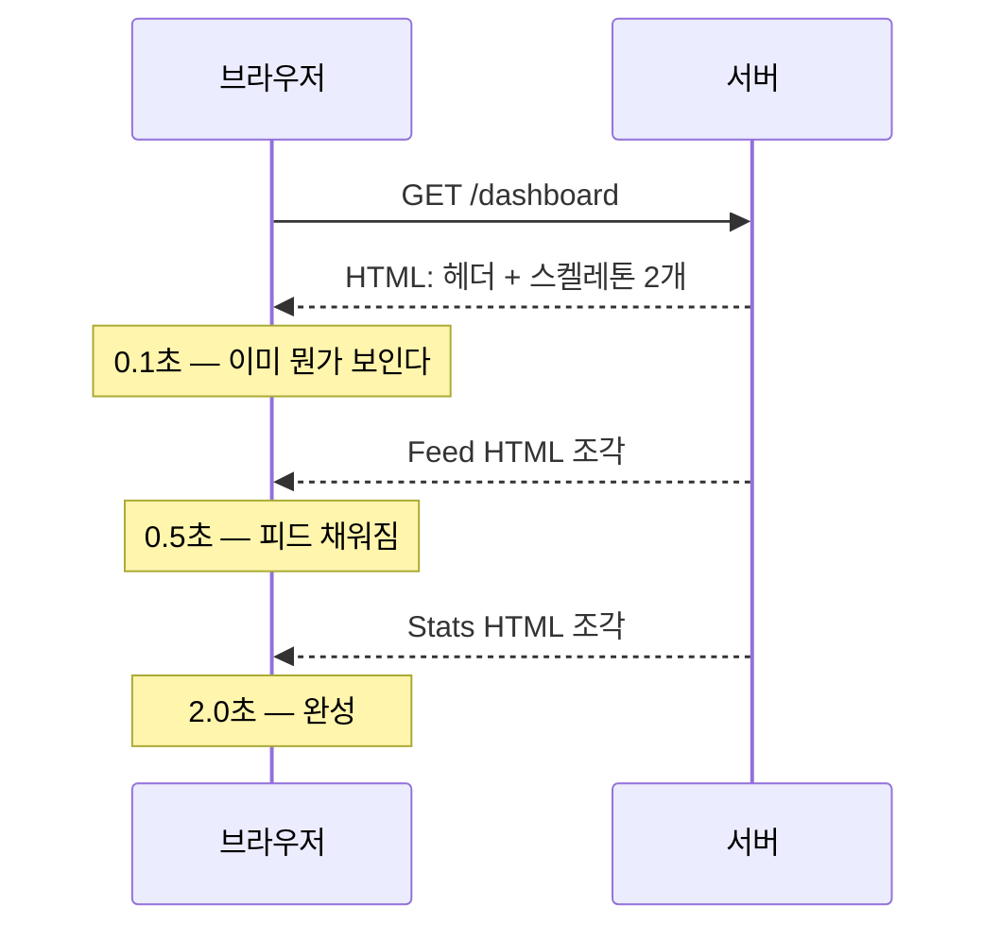

# 5. 데이터 가져오기

fetch가 컴포넌트 안으로 들어왔다

---

## 가장 단순한 형태

```tsx
// app/posts/page.tsx
export default async function PostsPage() {
  const posts = await db.post.findMany()
  return <PostList posts={posts} />
}
```

<v-clicks>

- `useEffect`도, 로딩 상태도, 에러 상태도 없다
- 이 컴포넌트는 **서버에서 한 번 실행되고 끝**이다
- `try/catch`나 `error.tsx`로 실패를 처리한다

</v-clicks>

<v-click>

<div class="pt-3 text-lg">
데이터를 가져오는 코드가 <strong>그 데이터를 쓰는 컴포넌트 옆에</strong> 있다.
이것이 App Router가 되찾은 가장 큰 것이다.
</div>

</v-click>

---

## 어디서 조회할 것인가

<div class="grid grid-cols-2 gap-6 pt-2">
<div>

**❌ 위에서 다 가져와 내려주기**

```tsx
export default async function Page() {
  const user = await getUser()
  const posts = await getPosts()
  const stats = await getStats()
  return (
    <Dashboard
      user={user}
      posts={posts}
      stats={stats}
    />
  )
}
```

세 쿼리가 **순차 실행**된다.
props가 계속 늘어난다.

</div>
<div>

**✅ 필요한 컴포넌트가 직접**

```tsx
export default function Page() {
  return (
    <>
      <UserCard />
      <PostList />
      <StatsPanel />
    </>
  )
}

async function PostList() {
  const posts = await getPosts()
  return <ul>{/* ... */}</ul>
}
```

각자 조회하고 **병렬로 실행**된다.

</div>
</div>

---

## 순차 vs 병렬 — 실제로 얼마나 차이 나는가

<BarChart
  :items="[['순차 (await 3번 연달아)', 900, '900ms'], ['Promise.all', 400, '400ms'], ['컴포넌트별 조회 + Suspense', 400, '400ms (첫 화면은 즉시)']]"
  :highlight="2"
/>

<div class="pt-4">

```tsx
// 한 컴포넌트 안에서 여러 개가 필요하다면 Promise.all
const [user, posts, stats] = await Promise.all([
  getUser(), getPosts(), getStats(),
])
```

</div>

<v-click>

<div class="pt-2 text-sm opacity-70">
서로 의존하지 않는 쿼리를 <code>await</code>로 줄줄이 늘어놓는 것이 App Router에서 가장 흔한 성능 실수다.
</div>

</v-click>

---

## 중복 조회는 `React.cache()`로

여러 컴포넌트가 같은 데이터를 필요로 하면 어떻게 되나?

```ts {1-8|10-16}
// lib/user.ts
import { cache } from 'react'

export const getUser = cache(async (id: string) => {
  console.log('DB 조회 실행')     // 한 요청당 한 번만 찍힌다
  return db.user.findUnique({ where: { id } })
})

// 이제 어디서 몇 번을 불러도 DB는 한 번만 간다
async function Header()  { const u = await getUser('1') /* ... */ }
async function Sidebar() { const u = await getUser('1') /* ... */ }
async function Profile() { const u = await getUser('1') /* ... */ }
```

<v-click>

<div class="pt-2">
<strong>요청 단위 메모이제이션</strong>이다. 요청이 끝나면 사라진다.
"props로 내려줄까 각자 부를까"를 고민할 필요가 없어진다 — <strong>각자 부르면 된다.</strong>
</div>

</v-click>

---

## `fetch`도 자동으로 중복 제거된다

```tsx
// 같은 URL + 같은 옵션 = 한 번만 나간다
async function A() { const r = await fetch('https://api.x/user/1') }
async function B() { const r = await fetch('https://api.x/user/1') }
```

<v-clicks>

- React가 `fetch`를 감싸 **같은 렌더 패스 안에서** 중복을 제거한다
- ORM이나 DB 클라이언트는 이 대상이 아니다 → `React.cache()`를 직접 쓴다
- `POST`처럼 부수효과가 있는 요청은 제외된다

</v-clicks>

---

## Suspense로 스트리밍

느린 데이터가 빠른 데이터를 막지 않게 한다.

```tsx {1-14|all}
import { Suspense } from 'react'

export default function Page() {
  return (
    <>
      <Header />                          {/* 즉시 */}
      <Suspense fallback={<StatsSkeleton />}>
        <SlowStats />                     {/* 2초 걸림 */}
      </Suspense>
      <Suspense fallback={<FeedSkeleton />}>
        <Feed />                          {/* 500ms */}
      </Suspense>
    </>
  )
}
```

<v-click>

<div class="pt-2">
Header가 먼저 보이고, Feed가 500ms에, Stats가 2초에 각각 <strong>도착하는 대로</strong> 채워진다.
전체가 2초를 기다리지 않는다.
</div>

</v-click>

---

## 스트리밍의 실제 모습



<v-clicks>

- 하나의 HTTP 응답이 **끊기지 않고 계속 흘러온다** (chunked transfer)
- JS가 없어도 동작한다. `<template>`과 인라인 스크립트로 채워 넣는 방식이다
- `loading.tsx`는 이 Suspense를 **페이지 전체에 자동으로 걸어주는 것**이다

</v-clicks>

---

## 어디에 Suspense를 걸 것인가

<div class="grid grid-cols-2 gap-6 pt-2">
<div>

**너무 넓게**

```tsx
<Suspense fallback={<PageSkeleton />}>
  <EntireDashboard />
</Suspense>
```

가장 느린 것 하나 때문에
전부가 스켈레톤이 된다.

</div>
<div>

**적당하게**

```tsx
<Header />
<Suspense fallback={<CardSkeleton />}>
  <Revenue />
</Suspense>
<Suspense fallback={<TableSkeleton />}>
  <RecentOrders />
</Suspense>
```

느린 영역만 개별적으로.

</div>
</div>

<v-click>

<div class="pt-3">
기준: <strong>"이 영역이 늦게 와도 나머지를 쓸 수 있는가?"</strong>
그렇다면 별도 경계를 만든다.
</div>

</v-click>

---

## 스켈레톤은 진짜 레이아웃을 흉내내야 한다

<div class="grid grid-cols-2 gap-6 pt-3">
<UiSurface label="나쁜 예 — 크기가 다름">
<div style="display:flex;align-items:center;justify-content:center;height:7.2rem">
  <span style="font-size:.85rem;opacity:.5">Loading…</span>
</div>
</UiSurface>

<UiSurface label="좋은 예 — 실제와 같은 크기">
<div style="display:flex;flex-direction:column;gap:.55rem;height:7.2rem">
  <div class="ui-skeleton" style="height:1.1rem;width:45%"></div>
  <div class="ui-skeleton" style="height:.8rem;width:80%"></div>
  <div class="ui-skeleton" style="height:.8rem;width:70%"></div>
  <div style="flex:1"></div>
  <div class="ui-skeleton" style="height:2.1rem;width:6rem"></div>
</div>
</UiSurface>
</div>

<div class="pt-3 text-sm opacity-70">
크기가 다르면 콘텐츠가 도착하는 순간 화면이 <strong>튄다</strong> (레이아웃 시프트).
shadcn/ui의 <code>Skeleton</code> 컴포넌트가 이 용도다.
</div>

---

## 외부 API를 쓸 때

```tsx {1-9|11-18}
// 서버 컴포넌트에서 직접 호출 — 키가 노출되지 않는다
async function Weather({ city }: { city: string }) {
  const res = await fetch(`https://api.weather.com/v1/${city}`, {
    headers: { 'X-Api-Key': process.env.WEATHER_KEY! },
  })
  if (!res.ok) throw new Error('날씨 조회 실패')
  const data = await res.json()
  return <div>{data.temp}°C</div>
}

// 응답 형태는 반드시 검증한다 — 외부 API는 언제든 바뀐다
import { z } from 'zod'

const WeatherSchema = z.object({ temp: z.number(), desc: z.string() })

const data = WeatherSchema.parse(await res.json())
```

<v-click>

외부 응답을 그대로 믿고 `data.temp`를 쓰면 **런타임에 조용히 깨진다.** 경계에서 파싱한다.

</v-click>

---

## 클라이언트에서 조회해야 하는 경우

서버 컴포넌트가 만능은 아니다. 아래는 클라이언트 조회가 맞다.

<v-clicks>

- **실시간 갱신** — 채팅, 알림, 라이브 대시보드 (폴링/웹소켓)
- **무한 스크롤** — 사용자 스크롤에 반응해 더 가져오기
- **낙관적 UI가 중요한 목록** — 좋아요, 투표
- **오프라인/캐시 우선** — PWA

</v-clicks>

<v-click>

<div class="pt-3">
이럴 땐 <strong>TanStack Query</strong>나 <strong>SWR</strong>을 쓴다.
서버 컴포넌트로 첫 데이터를 주고, 이후 갱신만 클라이언트가 맡는 조합이 가장 흔하다. (19장)
</div>

</v-click>

---

## 5장 요약

<v-clicks>

- 데이터 조회는 **그것을 쓰는 컴포넌트 안에서** 한다
- 위에서 다 가져와 내려주면 **순차 실행**된다 — 각자 조회하게 두면 병렬이 된다
- 중복은 **`React.cache()`**(ORM)와 **fetch 자동 중복 제거**로 해결된다
- **Suspense는 "늦게 와도 되는 영역"에 건다**
- 스켈레톤은 **실제 레이아웃과 같은 크기**여야 한다
- 실시간·무한스크롤은 여전히 **클라이언트 조회**가 맞다

</v-clicks>
