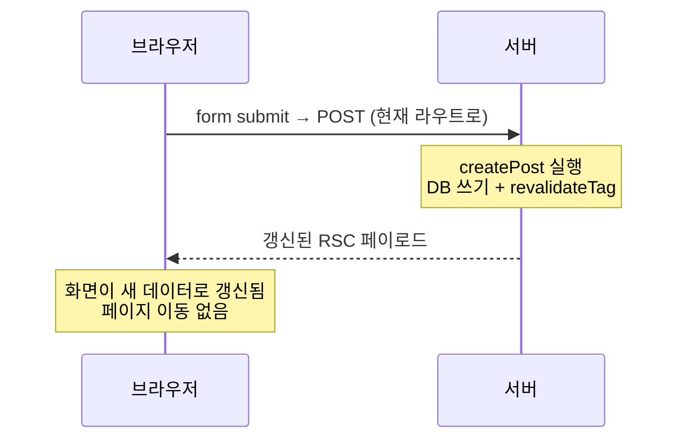

# 7. 데이터 바꾸기

Server Functions와 폼

---

## 읽기가 서버로 갔다면, 쓰기는?

<div class="text-xl py-4 leading-relaxed">
읽기: 서버 컴포넌트에서 <code>await db.query()</code><br>
쓰기: <strong>Server Function</strong>
</div>

<v-clicks>

- 클라이언트에서 **직접 호출할 수 있는 서버 함수**를 만드는 기능이다
- `fetch('/api/...')`를 손으로 쓰지 않아도 된다
- React 19의 기능이고, Next.js가 그 위에 라우팅·재검증을 얹었다
- 예전 이름은 "Server Actions"였다. 지금 문서는 **Server Functions**로 부른다

</v-clicks>

---

## 가장 단순한 형태

```ts {1-10|12-20}
// app/actions.ts
'use server'          // 이 파일의 export는 모두 서버 함수가 된다

import { revalidateTag } from 'next/cache'

export async function createPost(formData: FormData) {
  const title = formData.get('title') as string
  await db.post.create({ data: { title } })
  revalidateTag('posts')
}

// app/new/page.tsx — 서버 컴포넌트. 'use client' 없이 동작한다!
import { createPost } from '../actions'

export default function NewPost() {
  return (
    <form action={createPost}>
      <input name="title" />
      <button type="submit">저장</button>
    </form>
  )
}
```

---

## 여기서 무슨 일이 일어나는가



<v-clicks>

- 별도 API 라우트가 없다. **함수 참조 자체가 엔드포인트**가 된다
- 응답으로 **갱신된 UI**가 함께 온다. 별도로 다시 조회할 필요가 없다
- **JS가 로드되기 전에도 동작한다.** 순수 HTML form POST로 폴백된다

</v-clicks>

---

## 점진적 향상 (progressive enhancement)

<div class="text-lg py-2">
이게 Server Function의 가장 저평가된 특징이다.
</div>

<v-clicks>

- 느린 3G에서 JS가 아직 안 왔을 때 → **폼이 그냥 동작한다**
- JS 번들이 실패했을 때 → **폼이 그냥 동작한다**
- JS 비활성 환경 → **폼이 그냥 동작한다**

</v-clicks>

<v-click>

<div class="pt-4">
<code>onSubmit</code> + <code>fetch</code> 방식은 이 셋 모두에서 <strong>아무 일도 일어나지 않는다.</strong>
사용자는 버튼을 계속 누른다.
</div>

</v-click>

---

## 로딩·에러 상태: `useActionState`

```tsx {1-10|12-22}
// app/actions.ts
'use server'

export async function createPost(prevState: State, formData: FormData) {
  const title = formData.get('title') as string
  if (!title || title.length < 3) return { error: '제목은 3자 이상이어야 합니다' }
  await db.post.create({ data: { title } })
  revalidateTag('posts')
  return { ok: true }
}

// 클라이언트 쪽
'use client'
import { useActionState } from 'react'

export function PostForm() {
  const [state, formAction, isPending] = useActionState(createPost, {})
  return (
    <form action={formAction}>
      <input name="title" />
      {state.error && <p className="text-destructive">{state.error}</p>}
      <button disabled={isPending}>{isPending ? '저장 중…' : '저장'}</button>
    </form>
  )
}
```

---

## 실제로 보이는 모습

<div class="grid grid-cols-3 gap-4 pt-2">

<UiSurface label="기본">
<label class="ui-label">제목</label>
<input class="ui-input" placeholder="글 제목" readonly />
<div style="height:.6rem"></div>
<button class="ui-btn ui-btn--default">저장</button>
</UiSurface>

<UiSurface label="isPending">
<label class="ui-label">제목</label>
<input class="ui-input" value="새 글" readonly />
<div style="height:.6rem"></div>
<button class="ui-btn ui-btn--default" disabled>저장 중…</button>
</UiSurface>

<UiSurface label="state.error">
<label class="ui-label">제목</label>
<input class="ui-input" value="글" aria-invalid="true" readonly />
<div class="ui-error">제목은 3자 이상이어야 합니다</div>
<div style="height:.35rem"></div>
<button class="ui-btn ui-btn--default">저장</button>
</UiSurface>

</div>

<div class="pt-3 text-sm opacity-70">
세 상태 모두 shadcn/ui의 Input + Button으로 표현된다.
<code>aria-invalid</code>가 붙으면 테두리가 자동으로 destructive 색이 된다 — 19장에서 자세히 본다.
</div>

---

## 낙관적 업데이트: `useOptimistic`

서버 응답을 기다리지 않고 **먼저 화면을 바꾼다.** 실패하면 자동으로 되돌아간다.

```tsx
'use client'
import { useOptimistic } from 'react'

export function LikeButton({ post, likeAction }) {
  const [optimisticLikes, addOptimistic] = useOptimistic(
    post.likes,
    (current, delta: number) => current + delta
  )

  return (
    <form action={async () => {
      addOptimistic(1)        // 즉시 반영
      await likeAction(post.id)
    }}>
      <button>♥ {optimisticLikes}</button>
    </form>
  )
}
```

<v-click>

좋아요, 투표, 체크박스처럼 **거의 항상 성공하는** 동작에 쓴다.
결제처럼 실패가 의미 있는 동작에는 쓰지 않는다.

</v-click>

---

## Server Function은 공개 엔드포인트다

<div class="text-xl py-4 leading-relaxed">
이건 "서버에서 실행되니 안전한 함수"가 <strong>아니다.</strong><br>
누구나 호출할 수 있는 <strong>HTTP 엔드포인트</strong>다.
</div>

<v-clicks>

- 함수 참조가 클라이언트로 가면서 **고유 ID가 부여**된다. 그 ID로 직접 POST할 수 있다
- 폼을 화면에 안 보여준다고 해서 호출을 막을 수 없다
- `proxy.ts`의 matcher는 **Server Function 호출을 보장해 주지 않는다** (3장)

</v-clicks>

<v-click>

<div class="pt-3 text-lg">
<strong>모든 Server Function은 자기 안에서 인증·인가·검증을 다시 해야 한다.</strong>
</div>

</v-click>

---

## 안전한 Server Function 템플릿

```ts {1-6|8-21}
'use server'
import { z } from 'zod'
import { auth } from '@/lib/auth'

const UpdatePostSchema = z.object({ id: z.string().uuid(), title: z.string().min(3).max(200) })

export async function updatePost(_: State, formData: FormData) {
  // 1. 인증 — 누구인가
  const session = await auth()
  if (!session) return { error: '로그인이 필요합니다' }

  // 2. 검증 — 입력이 형식에 맞는가
  const parsed = UpdatePostSchema.safeParse(Object.fromEntries(formData))
  if (!parsed.success) return { error: '입력이 올바르지 않습니다' }

  // 3. 인가 — 이 사람이 이 리소스를 바꿔도 되는가
  const post = await db.post.findUnique({ where: { id: parsed.data.id } })
  if (post?.authorId !== session.user.id) return { error: '권한이 없습니다' }

  await db.post.update({ where: { id: parsed.data.id }, data: parsed.data })
  revalidateTag('posts')
  return { ok: true }
}
```

<v-click>

**인증 → 검증 → 인가 → 실행.** 이 네 단계를 모든 Server Function에서 반복한다.

</v-click>

---

## 반복을 줄이는 방법

```ts
// lib/safe-action.ts
export function authedAction<S extends z.ZodType, R>(
  schema: S,
  handler: (input: z.infer<S>, user: User) => Promise<R>
) {
  return async (formData: FormData) => {
    const session = await auth()
    if (!session) throw new Error('UNAUTHORIZED')
    const parsed = schema.safeParse(Object.fromEntries(formData))
    if (!parsed.success) throw new Error('INVALID_INPUT')
    return handler(parsed.data, session.user)
  }
}
```

<v-click>

<div class="pt-2">
직접 만들어도 되고, <strong>next-safe-action</strong>이나 <strong>zsa</strong> 같은 라이브러리를 써도 된다.
중요한 건 <strong>"검사를 빼먹을 수 없는 구조"</strong>를 만드는 것이다.
</div>

</v-click>

---

## 변경 후 화면 갱신하는 네 가지 방법

| 방법 | 언제 쓰나 |
|---|---|
| `revalidateTag('posts')` | 그 데이터를 쓰는 모든 캐시를 무효화 |
| `revalidatePath('/posts')` | 특정 경로만 |
| `redirect('/posts/123')` | 생성 후 상세 페이지로 이동 |
| 반환값 + `useOptimistic` | 즉시 반영이 중요한 소규모 변경 |

<v-click>

<div class="pt-3">
가장 흔한 실수: <strong>변경 후 아무것도 안 해서 화면이 그대로인 것.</strong>
DB는 바뀌었는데 사용자는 "저장이 안 됐다"고 느낀다.
</div>

</v-click>

---

## Server Function vs Route Handler

| | Server Function | Route Handler |
|---|---|---|
| 호출 주체 | 내 앱의 폼·버튼 | 외부 시스템, 모바일 앱 |
| 형태 | 함수 호출 | HTTP 요청 |
| 타입 | **양 끝이 자동으로 이어짐** | 직접 맞춰야 함 |
| 점진적 향상 | 됨 | 안 됨 |
| 웹훅 수신 | 부적합 | 적합 |
| 파일 업로드 | 됨 (FormData) | 됨 |

<v-click>

<div class="pt-3">
기준: <strong>"이걸 우리 앱 밖에서도 부를 일이 있는가?"</strong>
없다면 Server Function이다.
</div>

</v-click>

---

## 7장 요약

<v-clicks>

- `'use server'`로 **클라이언트에서 직접 부르는 서버 함수**를 만든다
- `<form action={fn}>`은 **JS 없이도 동작**한다 (점진적 향상)
- `useActionState`로 로딩·에러, `useOptimistic`으로 즉시 반영
- **Server Function은 공개 엔드포인트다** — 인증·검증·인가를 함수 안에서 다시 한다
- 변경 후에는 반드시 **`revalidateTag` / `revalidatePath` / `redirect`** 중 하나를 한다
- 외부에서 부를 일이 있으면 Route Handler, 없으면 Server Function

</v-clicks>
