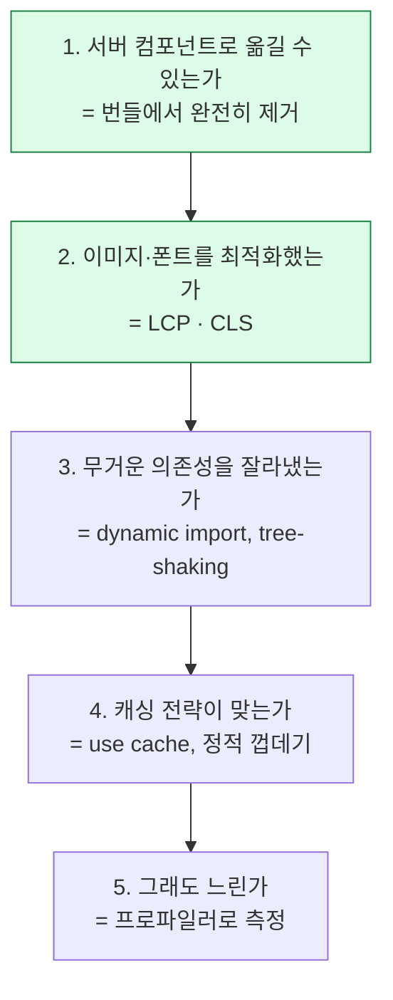

# 8. 성능

측정할 수 있는 것만 고친다

---

## 사용자가 실제로 느끼는 세 가지

| 지표 | 무엇을 재나 | 목표 |
|---|---|---|
| **LCP** | 가장 큰 콘텐츠가 보이기까지 | 2.5초 이하 |
| **INP** | 클릭·입력에 대한 반응 지연 | 200ms 이하 |
| **CLS** | 화면이 얼마나 튀는가 | 0.1 이하 |

<v-clicks>

- **LCP** — 보통 히어로 이미지나 첫 텍스트 블록. 서버 컴포넌트가 직접적으로 개선한다
- **INP** — JS 실행량과 직결된다. 클라이언트 번들이 작을수록 좋다
- **CLS** — 이미지·폰트·광고가 늦게 도착하며 레이아웃을 밀어내는 문제

</v-clicks>

<v-click>

<div class="pt-2 text-sm opacity-70">
셋 다 Chrome이 실제 사용자로부터 수집하며 검색 순위에도 반영된다.
</div>

</v-click>

---

## 레이아웃 시프트가 일어나는 순간

<div class="grid grid-cols-2 gap-6 pt-2">

<UiSurface label="이미지 크기 미지정 — CLS 발생">
<div style="font-size:.82rem;line-height:1.6">
<div style="font-weight:600">기사 제목</div>
<div style="height:.4rem"></div>
<div style="border:1px dashed #ef4444;color:#ef4444;font-size:.7rem;padding:.3rem;text-align:center">
이미지 도착 → 아래 내용이 갑자기 밀림
</div>
<div style="height:.4rem"></div>
<div style="opacity:.7">본문이 여기 있었는데 아래로 튀어 내려간다.</div>
</div>
</UiSurface>

<UiSurface label="width/height 지정 — 자리 예약됨">
<div style="font-size:.82rem;line-height:1.6">
<div style="font-weight:600">기사 제목</div>
<div style="height:.4rem"></div>
<div class="ui-skeleton" style="height:3.1rem"></div>
<div style="height:.4rem"></div>
<div style="opacity:.7">본문 위치가 처음부터 확정되어 있다.</div>
</div>
</UiSurface>

</div>

<div class="pt-3 text-sm opacity-70">
<code>next/image</code>는 width/height(또는 <code>fill</code>)를 <strong>필수</strong>로 요구한다.
불편해 보이지만 CLS를 원천 차단하는 설계다.
</div>

---

## `next/image`가 대신 해주는 일

```tsx
import Image from 'next/image'
import hero from './hero.png'

// 로컬 이미지 — 크기를 자동으로 안다
<Image src={hero} alt="제품 화면" priority />

// 원격 이미지 — 크기를 직접 알려준다
<Image
  src="https://cdn.example.com/a.jpg"
  alt="상품"
  width={640}
  height={480}
  sizes="(max-width: 768px) 100vw, 640px"
/>
```

<v-clicks>

- **포맷 변환** — 브라우저가 지원하면 AVIF/WebP로 자동 변환
- **크기별 생성** — `sizes`에 맞춰 여러 해상도를 만들고 `srcset`으로 제공
- **지연 로딩** — 뷰포트 밖 이미지는 기본적으로 나중에 로드
- **`priority`** — LCP 이미지에는 반드시 붙인다. 이게 없으면 LCP가 나빠진다

</v-clicks>

---

## `next/font` — 폰트 때문에 튀지 않게

```tsx
// app/layout.tsx
import { Inter } from 'next/font/google'

const inter = Inter({ subsets: ['latin'], display: 'swap' })

export default function RootLayout({ children }) {
  return (
    <html className={inter.className}>
      <body>{children}</body>
    </html>
  )
}
```

<v-clicks>

- 폰트 파일을 **빌드 타임에 다운로드해 자체 호스팅**한다 — 구글 서버로 요청이 안 나간다
- `size-adjust`를 자동 계산해 **폰트 교체 시 레이아웃이 튀지 않게** 한다
- 한글 폰트는 용량이 커서 `subsets` 지정이 특히 중요하다

</v-clicks>

<v-click>

<div class="pt-2 text-sm opacity-70">
Pretendard 같은 로컬 폰트는 <code>next/font/local</code>로 같은 이점을 얻는다.
</div>

</v-click>

---

## 번들 줄이기 — 무거운 것은 잘라낸다

```tsx {1-9|11-18}
// 차트, 에디터, 지도처럼 크고 즉시 필요 없는 것
import dynamic from 'next/dynamic'

const Chart = dynamic(() => import('@/components/chart'), {
  loading: () => <ChartSkeleton />,
  ssr: false,      // 브라우저 API에 의존한다면
})

// 조건부로만 쓰이는 것
const AdminPanel = dynamic(() => import('./admin-panel'))

export function Page({ isAdmin }) {
  return (
    <>
      <Dashboard />
      {isAdmin && <AdminPanel />}   {/* 관리자가 아니면 아예 안 받는다 */}
    </>
  )
}
```

<v-click>

먼저 확인할 것: **그 컴포넌트가 정말 클라이언트여야 하는가?**
서버 컴포넌트로 만들 수 있으면 `dynamic`보다 그쪽이 낫다.

</v-click>

---

## 무엇이 번들을 키우는가

<BarChart
  :items="[['moment.js (locale 전체)', 290, '290 kB'], ['lodash 전체 import', 71, '71 kB'], ['차트 라이브러리', 180, '180 kB'], ['date-fns (필요 함수만)', 12, '12 kB'], ['Intl.DateTimeFormat (내장)', 0, '0 kB']]"
  :highlight="4"
/>

<v-clicks>

- `import _ from 'lodash'` → `import debounce from 'lodash/debounce'`
- 날짜 포맷은 대부분 **브라우저 내장 `Intl`**로 충분하다
- 아이콘 라이브러리는 **개별 import**가 되는지 확인한다 (lucide-react는 된다)

</v-clicks>

---

## 측정 도구

```bash
# 번들 구성 시각화
pnpm add -D @next/bundle-analyzer
ANALYZE=true pnpm build

# 빌드 결과에 라우트별 First Load JS가 표시된다
pnpm build
```

```text
Route (app)                    Size     First Load JS
┌ ○ /                          1.2 kB          92 kB
├ ○ /dashboard                 45 kB          186 kB   ← 여기를 본다
└ ● /posts/[slug]              2.1 kB          94 kB

○  (Static)   정적 생성
●  (SSG)      generateStaticParams로 생성
```

<v-click>

**First Load JS가 라우트별로 크게 차이 난다면** 그 라우트에 무거운 클라이언트 컴포넌트가 있다는 뜻이다.

</v-click>

---

## React Compiler

React 19와 함께 1.0이 정식 출시됐다. **메모이제이션을 자동으로** 해준다.

<div class="grid grid-cols-2 gap-6 pt-2">
<div>

**직접 하던 것**

```tsx
const sorted = useMemo(
  () => items.sort(cmp),
  [items]
)
const onClick = useCallback(
  () => select(id),
  [id]
)
```

</div>
<div>

**컴파일러가 하는 것**

```tsx
const sorted = items.sort(cmp)
const onClick = () => select(id)
```

컴파일 시점에 필요한 메모이제이션을
자동으로 삽입한다.

</div>
</div>

<v-click>

<div class="pt-3 text-sm opacity-70">
서버 컴포넌트에는 해당 없다 — 애초에 리렌더가 없기 때문이다.
클라이언트 컴포넌트가 많은 프로젝트에서 효과가 크다.
</div>

</v-click>

---

## Turbopack

Next.js 16부터 **기본 번들러**다. webpack 설정은 그대로 동작하지 않는다.

<v-clicks>

- dev 서버 시작과 HMR이 눈에 띄게 빨라진다
- `next.config.ts`의 `webpack:` 설정을 쓰고 있었다면 **turbopack 설정으로 옮겨야** 한다
- 커스텀 로더가 있으면 대체 방법을 확인해야 한다

</v-clicks>

<v-click>

<div class="pt-3">
대부분의 프로젝트는 아무것도 안 해도 된다.
webpack 플러그인을 쓰던 프로젝트만 마이그레이션 작업이 필요하다.
</div>

</v-click>

---

## 성능 개선의 우선순위



<v-click>

**1~2번을 건너뛰고 3번부터 하는 경우가 많다.** 효과 대비 노력이 가장 좋은 것은 위쪽이다.

</v-click>

---

## 8장 요약

<v-clicks>

- **LCP · INP · CLS** — 이 셋만 보면 된다
- `next/image`는 크기 지정을 강제해 **CLS를 원천 차단**한다. LCP 이미지엔 `priority`
- `next/font`는 폰트를 **자체 호스팅**하고 교체 시 레이아웃 시프트를 막는다
- 번들은 **서버 컴포넌트화 → tree-shaking → dynamic import** 순으로 줄인다
- React Compiler가 `useMemo`/`useCallback`을 대신해 준다
- Next.js 16의 기본 번들러는 **Turbopack**

</v-clicks>
