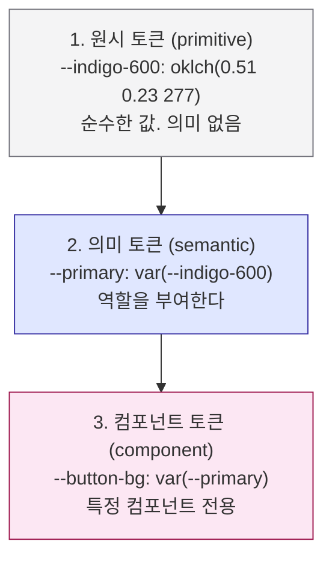
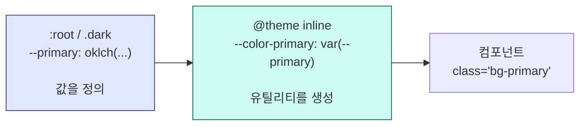

# 12. 디자인 토큰

디자인 시스템의 실체

---

## 이 장이 이 덱의 중심이다

<div class="text-xl py-4 leading-relaxed">
"디자인 시스템을 도입한다"는 말의 <strong>90%는 토큰 이야기</strong>다.<br>
나머지는 그 토큰을 쓰는 컴포넌트와 문서다.
</div>

<v-clicks>

- 토큰을 제대로 설계하면 → 테마 교체가 **CSS 변수 몇 줄**이 된다
- 토큰 없이 만들면 → 디자인 변경이 **전 파일 찾아 바꾸기**가 된다
- 17장에서 실제 디자인 시스템을 얹을 때 이 장의 구조를 그대로 쓴다

</v-clicks>

---

## 토큰이란 무엇인가

<div class="text-2xl py-6 leading-relaxed">
디자인 결정에 <strong>이름을 붙여 저장한 값.</strong>
</div>

```css
/* 결정: 우리 브랜드의 주 색상은 이 색이다 */
--primary: oklch(0.55 0.22 264);

/* 결정: 기본 모서리 둥글기는 이 정도다 */
--radius: 0.5rem;
```

<v-clicks>

- 값이 아니라 **결정**을 저장한다는 게 핵심이다
- `#4f46e5`는 값이고, `--primary`는 결정이다
- 결정이 바뀌면 **한 곳만** 고친다

</v-clicks>

---

## 3단 구조

토큰을 한 층으로 만들면 금방 무너진다. 실무에서는 **세 층**으로 나눈다.



<v-click>

<div class="pt-2">
<strong>대부분의 프로젝트는 1·2단만 있으면 충분하다.</strong>
3단은 컴포넌트가 아주 많고 팀이 나뉘어 있을 때 필요해진다.
</div>

</v-click>

---

## 왜 의미 층이 필요한가

<div class="grid grid-cols-2 gap-6 pt-2">
<div>

**원시 토큰만 쓸 때**

```html
<button class="bg-zinc-900 text-zinc-50">
<div class="bg-zinc-900 text-zinc-50">
<span class="bg-zinc-900 text-zinc-50">
```

브랜드 색을 파랑으로 바꾸려면?
→ **전부 찾아서 바꿔야 한다**

그리고 이 중 어떤 게 "주요 버튼"이고
어떤 게 "그냥 어두운 배경"인지 구분이 안 된다.

</div>
<div>

**의미 토큰을 쓸 때**

```html
<button class="bg-primary text-primary-foreground">
<div class="bg-card text-card-foreground">
<span class="bg-muted text-muted-foreground">
```

브랜드 색을 바꾸려면?
→ **`--primary` 한 줄**

의도가 이름에 드러난다.

</div>
</div>

<v-click>

<div class="pt-3 text-lg">
<strong>규칙: 컴포넌트 안에서는 원시 색을 직접 쓰지 않는다.</strong>
</div>

</v-click>

---
class: denser
---

## shadcn/ui의 토큰 목록

`background` / `foreground` **짝**으로 이루어진 것이 핵심 규칙이다.

| 토큰 쌍 | 용도 |
|---|---|
| `background` / `foreground` | 앱 바탕, 기본 텍스트 |
| `card` / `card-foreground` | 카드처럼 떠 있는 표면 |
| `popover` / `popover-foreground` | 드롭다운, 툴팁 등 오버레이 |
| `primary` / `primary-foreground` | 주요 액션 |
| `secondary` / `secondary-foreground` | 보조 액션 |
| `muted` / `muted-foreground` | 흐린 배경, 설명 텍스트 |
| `accent` / `accent-foreground` | 호버·포커스 강조 |
| `destructive` | 삭제·오류 |
| `border` / `input` / `ring` | 테두리 / 입력 테두리 / 포커스 링 |
| `chart-1` ~ `chart-5` | 차트 팔레트 |
| `sidebar-*` | 사이드바 전용 세트 |

---

## `-foreground` 규칙이 하는 일

<div class="text-lg py-2">
<strong>바탕색을 정하면 그 위의 글자색이 따라온다.</strong> 이 짝이 대비를 보장한다.
</div>

<div class="grid grid-cols-4 gap-3 pt-2">
<UiSurface label="primary" :padded="false">
<div style="background:var(--ui-primary);color:var(--ui-primary-foreground);padding:1rem;border-radius:.5rem;font-size:.82rem">
<strong>primary</strong><br>primary-foreground
</div>
</UiSurface>
<UiSurface label="secondary" :padded="false">
<div style="background:var(--ui-secondary);color:var(--ui-secondary-foreground);padding:1rem;border-radius:.5rem;font-size:.82rem">
<strong>secondary</strong><br>secondary-foreground
</div>
</UiSurface>
<UiSurface label="muted" :padded="false">
<div style="background:var(--ui-muted);color:var(--ui-muted-foreground);padding:1rem;border-radius:.5rem;font-size:.82rem">
<strong>muted</strong><br>muted-foreground
</div>
</UiSurface>
<UiSurface label="destructive" :padded="false">
<div style="background:var(--ui-destructive);color:#fff;padding:1rem;border-radius:.5rem;font-size:.82rem">
<strong>destructive</strong><br>흰 글자
</div>
</UiSurface>
</div>

<div class="pt-4 text-sm opacity-70">
그래서 컴포넌트는 <code>bg-primary text-primary-foreground</code>를 <strong>항상 함께</strong> 쓴다.
한쪽만 바꾸면 대비가 깨진다.
</div>

---

## 실제 CSS

```css
/* app/globals.css */
:root {
  --radius: 0.625rem;
  --background: oklch(1 0 0);
  --foreground: oklch(0.145 0 0);
  --card: oklch(1 0 0);
  --card-foreground: oklch(0.145 0 0);
  --primary: oklch(0.205 0 0);
  --primary-foreground: oklch(0.985 0 0);
  --muted: oklch(0.97 0 0);
  --muted-foreground: oklch(0.556 0 0);
  --border: oklch(0.922 0 0);
  --ring: oklch(0.708 0 0);
}

.dark {
  --background: oklch(0.145 0 0);
  --foreground: oklch(0.985 0 0);
  --primary: oklch(0.922 0 0);
  --primary-foreground: oklch(0.205 0 0);
  /* … 같은 이름, 다른 값 */
}
```

---

## 다크 모드가 공짜인 이유

<v-clicks>

- 컴포넌트는 `bg-background text-foreground`만 쓴다
- `.dark` 클래스가 붙으면 **같은 이름의 변수 값만 바뀐다**
- 컴포넌트 코드에 `dark:` 변형이 거의 등장하지 않는다

</v-clicks>

<div class="grid grid-cols-2 gap-6 pt-3">
<UiSurface label=":root"><LoginCard compact /></UiSurface>
<UiSurface label=".dark" theme="dark"><LoginCard theme="dark" compact /></UiSurface>
</div>

<div class="pt-3 text-sm opacity-70">
두 카드의 <strong>마크업과 클래스는 완전히 동일</strong>하다. 바뀐 것은 변수 값뿐이다.
</div>

---

## `@theme inline`으로 Tailwind에 연결

CSS 변수를 정의하는 것만으로는 `bg-primary` 유틸리티가 생기지 않는다. 연결이 필요하다.

```css
@import "tailwindcss";

@theme inline {
  --color-background: var(--background);
  --color-foreground: var(--foreground);
  --color-primary: var(--primary);
  --color-primary-foreground: var(--primary-foreground);
  --color-muted: var(--muted);
  --color-muted-foreground: var(--muted-foreground);
  --color-border: var(--border);
  --color-ring: var(--ring);
  /* … 나머지 토큰 전부 */
}
```

<v-click>

<div class="pt-2">
<code>inline</code>이 붙는 이유: 값이 <strong>다른 변수를 참조</strong>하기 때문이다.
<code>inline</code> 없이 쓰면 <code>.dark</code>의 재정의가 제대로 반영되지 않을 수 있다.
</div>

</v-click>

---

## 두 층을 구분해서 보기



<v-clicks>

- 왼쪽: **무슨 값인가** — 테마마다 다르다
- 가운데: **어떤 유틸리티를 만들 것인가** — 한 번만 쓴다
- 오른쪽: **어떻게 쓰는가** — 이름만 안다

</v-clicks>

---
class: dense
---

## radius는 파생 스케일로

색만 토큰이 아니다. 모서리 둥글기도 **하나에서 파생**시킨다.

```css
@theme inline {
  --radius-sm: calc(var(--radius) * 0.6);
  --radius-md: calc(var(--radius) * 0.8);
  --radius-lg: var(--radius);
  --radius-xl: calc(var(--radius) * 1.4);   /* … 2xl까지 이어진다 */
}
```

<v-click>

<div class="pt-1">
<code>--radius</code> 하나를 <code>0.125rem</code>으로 바꾸면 <strong>앱 전체가 각져지고</strong>,
<code>1.25rem</code>으로 바꾸면 Material 스타일이 된다.
</div>

</v-click>

<div class="grid grid-cols-3 gap-4 pt-2">
<UiSurface label="--radius: 0.125rem" theme="corporate"><LoginCard theme="corporate" compact /></UiSurface>
<UiSurface label="--radius: 0.5rem" theme="shadcn"><LoginCard compact /></UiSurface>
<UiSurface label="--radius: 1.25rem" theme="material"><LoginCard theme="material" compact /></UiSurface>
</div>

---

## 왜 oklch인가

shadcn/ui의 기본 토큰은 hex나 hsl이 아니라 **oklch**로 되어 있다.

<v-clicks>

- **인지적 균일성** — `oklch(0.5 ...)`인 두 색은 사람 눈에 실제로 같은 밝기다
- hsl은 그렇지 않다. `hsl(60 100% 50%)`(노랑)이 `hsl(240 100% 50%)`(파랑)보다 훨씬 밝다
- 그래서 hsl로 만든 팔레트는 **명도 계단이 들쭉날쭉**해진다
- oklch는 **P3 같은 넓은 색역**도 표현할 수 있다

</v-clicks>

<v-click>

<div class="pt-3">
실무적 이득: <strong>스케일을 프로그래밍으로 생성해도 자연스럽다.</strong>
L값만 일정하게 낮추면 균일한 팔레트가 나온다.
</div>

</v-click>

---

## 토큰 추가하기 — `warning`을 예로

기본 토큰에 `warning`이 없다. 직접 추가해 보자.

```css {1-9|11-14}
:root {
  --warning: oklch(0.84 0.16 84);
  --warning-foreground: oklch(0.28 0.07 46);
}

.dark {
  --warning: oklch(0.41 0.11 46);
  --warning-foreground: oklch(0.99 0.02 95);
}

@theme inline {
  --color-warning: var(--warning);
  --color-warning-foreground: var(--warning-foreground);
}
```

```html
<div class="bg-warning text-warning-foreground">주의</div>
```

<v-click>

**세 곳을 모두 건드려야 한다**: light 값, dark 값, `@theme inline` 연결.
하나라도 빠지면 다크 모드에서 깨지거나 유틸리티가 안 생긴다.

</v-click>

---

## 색 이외의 토큰

| 종류 | 예 | 비고 |
|---|---|---|
| 간격 | `--spacing` | v4는 이 하나에서 전체 스케일이 파생된다 |
| 타이포 | `--font-sans`, `--text-*` | 폰트 패밀리와 크기 스케일 |
| 모서리 | `--radius` | 파생 스케일 |
| 그림자 | `--shadow-*` | 고도(elevation) 표현 |
| 애니메이션 | `--animate-*`, `--ease-*` | 지속시간·이징 |
| z-index | 토큰화 권장 | `z-50`, `z-9999` 난립 방지 |

<v-click>

<div class="pt-3 text-sm opacity-70">
z-index는 Tailwind 기본 스케일이 있지만, 모달·토스트·드롭다운의 층위는
프로젝트마다 정해야 한다. <code>--z-modal: 50</code> 식으로 명시해 두면 싸움이 줄어든다.
</div>

</v-click>

---

## 토큰 안티패턴

<v-clicks>

- **의미 없는 이름** — `--color-1`, `--blue-2`. 나중에 아무도 못 쓴다
- **의미 층을 건너뜀** — 컴포넌트에서 `bg-zinc-900` 직접 사용
- **너무 이른 3단 구조** — 컴포넌트 토큰을 처음부터 다 만들면 관리가 안 된다
- **`-foreground` 짝을 안 지킴** — 다크 모드에서 대비가 깨진다
- **`@theme inline` 연결 누락** — 변수는 있는데 유틸리티가 없다
- **디자인 툴과 이름 불일치** — Figma는 `Brand/Primary`, 코드는 `--accent`

</v-clicks>

---

## Figma와 이름 맞추기

<v-clicks>

- Figma Variables와 CSS 변수의 **이름을 같게** 만든다
- 디자이너가 "primary를 바꿨어요"라고 하면 개발자가 바로 어디를 고칠지 안다
- 자동화도 가능하다 — Figma API → Style Dictionary → CSS 변수 생성

</v-clicks>

<v-click>

<div class="pt-3">
자동화까지 안 가더라도 <strong>이름만 맞춰도</strong> 커뮤니케이션 비용이 크게 준다.
"그 회색"이 아니라 "muted-foreground"라고 말하게 된다.
</div>

</v-click>

---

## 12장 요약

<v-clicks>

- 토큰은 **값이 아니라 결정**에 이름을 붙인 것
- **원시 → 의미** 두 층이면 대부분 충분하다. 컴포넌트 토큰은 필요해질 때
- shadcn/ui는 **`background`/`foreground` 짝**으로 대비를 보장한다
- **`:root`/`.dark`에서 값 정의 → `@theme inline`에서 유틸리티 생성** 두 단계
- 다크 모드가 공짜인 이유: **이름은 그대로, 값만 바뀌기 때문**
- `--radius` 하나로 앱 전체 인상이 바뀐다
- 토큰 추가는 **light / dark / `@theme inline`** 세 곳을 모두 건드린다

</v-clicks>
