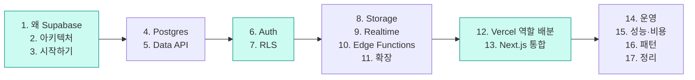

# 0. 오리엔테이션

이 덱을 어떻게 읽으면 되는가

---

## 이 덱은 누구를 위한 것인가

<v-clicks>

- **웹 개발 경험은 있는데 Supabase는 처음**인 개발자
- SQL을 아주 잘 알 필요는 없다. 필요한 만큼은 중간에 다시 짚는다
- 이미 Firebase나 직접 만든 Express/Nest 백엔드를 써본 적이 있다면 비교 지점이 더 잘 보인다
- Next.js + Vercel 조합을 쓰고 있거나 쓸 계획이라면 12~13장이 특히 유용하다

</v-clicks>

<v-click>

전제하지 않는 것: Postgres 심화 지식, 데브옵스 경험, Deno 경험

</v-click>

---

## 이 덱에서 다루는 것과 다루지 않는 것

<div class="grid grid-cols-2 gap-6 pt-4">
<div>

**다룬다**

- 왜 Supabase를 선택하는가 / 언제 선택하면 안 되는가
- 각 기능의 "실체"가 Postgres에서 무엇인지
- Vercel과의 역할 배분과 배포 아키텍처
- 실전 운영: 마이그레이션, 브랜칭, 성능, 비용

</div>
<div>

**다루지 않는다**

- Postgres 튜닝 심화 (vacuum, WAL 파라미터 등)
- Supabase 자체 셀프호스팅 운영
- 모바일 SDK(Flutter, Swift) 상세
- AI/벡터는 "이런 게 있다" 수준까지만

</div>
</div>

---

## 전체 로드맵



색칠된 블록이 이 덱의 뼈대다. **Auth + RLS**를 이해하면 Supabase의 절반은 끝난다.

---

## 미리 잡아두면 좋은 멘탈 모델 3가지

<v-clicks>

**1. Supabase는 프레임워크가 아니라 "관리형 Postgres + 주변부"다**
새 API를 배우는 게 아니라, 이미 있는 데이터베이스를 네트워크 너머로 안전하게 여는 방법을 배우는 것이다.

**2. 권한은 애플리케이션이 아니라 데이터베이스가 판단한다**
`if (user.id !== post.authorId) throw` 같은 코드가 SQL 정책(RLS)으로 내려간다. 이 전환이 가장 큰 사고방식의 변화다.

**3. Supabase는 상태를, Vercel은 실행을 맡는다**
둘은 경쟁 관계가 아니다. 역할이 겹치는 지점(Edge Functions vs Route Handlers)만 정리하면 된다.

</v-clicks>

---

## 실습 환경 준비물

```bash
# 1) Node 20+ 와 패키지 매니저
node -v

# 2) Docker Desktop — 로컬 Supabase 스택을 컨테이너로 띄우는 데 필요
docker info

# 3) Supabase CLI (macOS)
brew install supabase/tap/supabase

## 프로젝트 의존성으로 설치하는 방법도 공식 문서가 권장한다
# npm install supabase --save-dev
```

<v-click>

계정은 [supabase.com](https://supabase.com)에서 GitHub 로그인으로 만들 수 있고,
**Free 플랜만으로도 이 덱의 거의 모든 내용을 실습할 수 있다.**

</v-click>

---

## 자주 나올 용어 미리보기

| 용어 | 한 줄 설명 |
|---|---|
| **PostgREST** | 테이블/뷰/함수를 자동으로 REST API로 노출해 주는 서버 |
| **RLS** | Row Level Security. 행 단위 접근 제어. Postgres 네이티브 기능 |
| **JWT** | 로그인 후 발급되는 서명된 토큰. 여기 담긴 `sub`가 곧 사용자 ID |
| **anon / authenticated / service_role** | 요청이 매핑되는 Postgres 역할 3종 |
| **publishable / secret key** | 클라이언트에 노출해도 되는 키 / 서버 전용 키 |
| **Supavisor** | Supabase의 커넥션 풀러. 서버리스에서 필수 |
| **migration** | 스키마 변경을 SQL 파일로 버전 관리한 것 |
