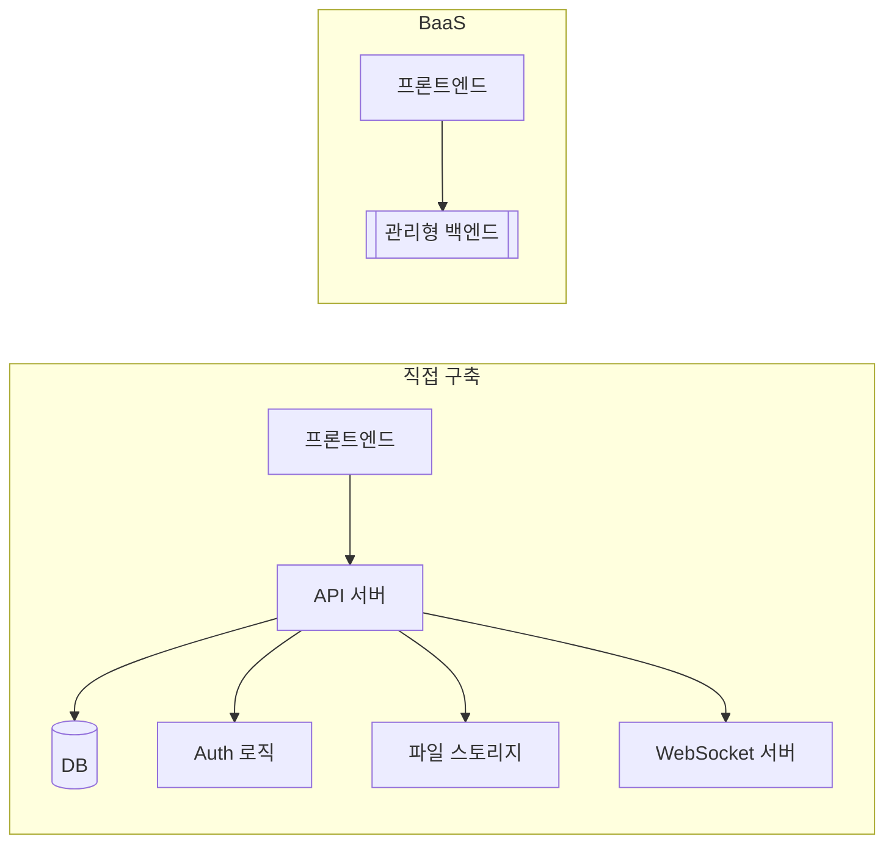
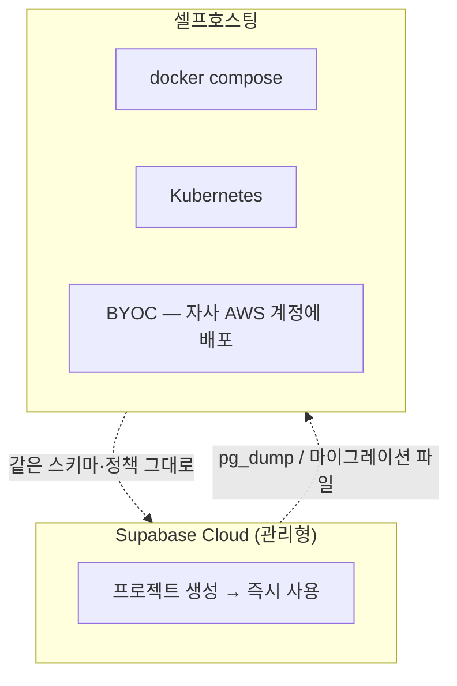

# 1. 왜 Supabase인가

선택의 근거를 먼저 세우고 들어간다

---

## 백엔드를 처음부터 만들 때 반복되는 일들

새 프로젝트를 시작할 때마다 거의 같은 목록을 다시 만든다.

<v-clicks>

- DB 띄우기, 커넥션 풀 설정, 마이그레이션 도구 붙이기
- 회원가입 · 로그인 · 비밀번호 재설정 · 이메일 인증 · 소셜 로그인
- 세션/토큰 관리, 리프레시 로직, 만료 처리
- 파일 업로드, 썸네일 생성, 접근 권한이 걸린 파일 서빙
- 실시간 갱신이 필요하면 WebSocket 서버 한 벌 더
- 그리고 이 모든 것의 **배포 · 모니터링 · 백업**

</v-clicks>

<v-click>

문제는 이게 다 **제품의 차별점이 아니라는 것**이다. 어느 서비스나 똑같이 필요하다.

</v-click>

---

## BaaS라는 선택지

Backend as a Service — 위 목록을 통째로 제품으로 사 오는 접근.



<v-click>

BaaS의 전통적 대가는 **종속성**이다. 데이터 모델도, 쿼리 언어도, 운영 방식도 그 회사 것이 된다.
Supabase는 이 대가를 줄이는 방향으로 설계된 BaaS다.

</v-click>

---

## Supabase의 한 줄 정의

<div class="text-2xl py-6 leading-relaxed">
<strong>관리형 Postgres 한 대</strong>와, 그 위에서 돌아가는<br>
<strong>Auth · REST API · Realtime · Storage · Edge Functions</strong>를<br>
한 프로젝트로 묶어 파는 오픈소스 플랫폼.
</div>

<v-clicks>

- "Firebase 대안"이라는 표현이 흔하지만, 실제 정체성은 **Postgres 플랫폼**이다
- 각 기능은 Postgres 위에 얹힌 별도 오픈소스 서버들이다 (뒤에서 하나씩 본다)
- 그래서 SQL로 직접 만질 수 있고, `pg_dump`로 통째로 들고 나올 수 있다

</v-clicks>

---

## "그냥 Postgres다"가 왜 중요한가

<v-clicks>

**1. 배운 게 남는다**
Supabase를 배우는 시간의 대부분이 Postgres를 배우는 시간이다. 회사를 옮겨도, 플랫폼을 바꿔도 남는다.

**2. 도구 생태계를 그대로 쓴다**
Prisma, Drizzle, TypeORM, DBeaver, pgAdmin, Metabase — Postgres에 붙는 건 전부 붙는다.

**3. 데이터를 인질로 잡히지 않는다**
표준 Postgres 덤프를 뜰 수 있다. 이전 경로가 항상 열려 있다는 사실 자체가 협상력이다.

**4. 관계형 모델의 힘을 포기하지 않는다**
JOIN, 트랜잭션, 외래 키, 제약 조건, 뷰, 함수, 트리거 — 전부 그대로 있다.

</v-clicks>

---

## Firebase와의 결정적 차이 (1) 데이터 모델

<div class="grid grid-cols-2 gap-6 pt-2">
<div>

**Firestore (문서형)**

- 컬렉션 / 문서 / 서브컬렉션
- 스키마 없음 → 초반 속도가 빠름
- 관계는 문서 ID를 손으로 들고 다님
- **비정규화가 사실상 강제됨** (조회 패턴마다 데이터를 복제해 둠)

</div>
<div>

**Supabase (관계형)**

- 테이블 / 행 / 열, 외래 키로 관계 표현
- 스키마 강제 → 잘못된 데이터가 애초에 안 들어감
- JOIN으로 조합, 중복 저장 불필요
- **정규화가 기본**, 필요할 때만 뷰나 머티리얼라이즈드 뷰로 최적화

</div>
</div>

<v-click>

비정규화의 진짜 비용은 저장 공간이 아니라 **정합성 유지 코드**다.
"프로필 이름 바꾸면 그 사람이 쓴 모든 댓글의 작성자 이름도 바꿔야 한다" 같은 일이 없어진다.

</v-click>

---

## Firebase와의 결정적 차이 (2) 쿼리

같은 요구사항: "지난 30일간 카테고리별 주문 합계, 상위 5개"

<div class="grid grid-cols-2 gap-4 pt-2">
<div>

**Firestore**

- 집계 쿼리가 제한적 → 앱에서 전부 읽어와 계산하거나
- Cloud Function으로 미리 집계 문서를 만들어 두고 갱신
- 즉, **질문이 생길 때마다 파이프라인을 하나 만든다**

</div>
<div>

**Supabase**

```sql
select category, sum(total) as revenue
from orders
where created_at > now() - interval '30 days'
group by category
order by revenue desc
limit 5;
```

</div>
</div>

<v-click>

관계형 DB의 가치는 **미리 예상하지 못한 질문에 답할 수 있다는 것**이다.
제품이 성숙할수록 이 차이가 크게 벌어진다.

</v-click>

---

## Firebase와의 결정적 차이 (3) 종속성

<v-clicks>

- Supabase의 구성 요소는 대부분 **개별 오픈소스 프로젝트**다
  (Postgres, PostgREST, GoTrue, Realtime, Storage API, Supavisor…)
- `docker compose`로 셀프호스팅할 수 있고, 실제로 그렇게 운영하는 곳이 있다
- 최악의 시나리오(가격 인상, 서비스 종료)에서도 **탈출 경로가 문서화되어 있다**

</v-clicks>

<v-click>

현실적으로는 대부분 셀프호스팅하지 않는다. 중요한 건 **할 수 있다는 사실**이
의사결정의 위험도를 낮춰준다는 점이다. 특히 회사에서 도입 승인을 받을 때 그렇다.

</v-click>

---
class: dense
---

## 비교표: Supabase vs Firebase vs 직접 구축

| | Supabase | Firebase | 직접 구축 |
|---|---|---|---|
| 데이터 모델 | 관계형 (Postgres) | 문서형 | 자유 |
| 쿼리 | SQL 전체 | 제한적 | 자유 |
| 권한 모델 | RLS (DB 내부) | Security Rules | 앱 코드 |
| 초기 속도 | 빠름 | 매우 빠름 | 느림 |
| 오픈소스 | ○ | ✕ | ○ |
| 셀프호스팅 | ○ | ✕ | ○ |
| 실시간 | ○ | ◎ | 직접 |
| 운영 부담 | 낮음 | 매우 낮음 | 높음 |
| 학습 전이성 | 높음 (Postgres) | 낮음 | 높음 |

---

## 제품 구성 한눈에 보기

<div class="grid grid-cols-2 gap-x-8 gap-y-2 pt-2 text-sm">
<div>

**Database** — 관리형 Postgres. 전체 권한 제공
**Auth** — 이메일/소셜/OTP/SSO, JWT 발급
**Storage** — S3 호환 객체 스토리지 + CDN
**Realtime** — WebSocket 브로드캐스트/프레즌스/DB 변경 구독

</div>
<div>

**Edge Functions** — Deno 기반 서버리스 함수
**Vector** — pgvector 기반 임베딩 검색
**Cron / Queues** — pg_cron, pgmq 기반 스케줄·큐
**Studio** — 웹 대시보드 (테이블 편집, SQL 에디터, 로그)

</div>
</div>

<v-click>

**핵심:** 이 모든 게 한 Postgres 인스턴스를 공유한다.
Auth 사용자도 `auth.users` 테이블이고, Storage 파일 메타데이터도 `storage.objects` 테이블이다.
그래서 조인이 되고, 트랜잭션이 되고, 외래 키가 걸린다.

</v-click>

---

## 개발 속도가 실제로 빨라지는 지점

<v-clicks>

**테이블을 만들면 API가 즉시 생긴다**
PostgREST가 스키마를 읽어 REST 엔드포인트를 자동 생성한다. API 서버 코드가 0줄이다.

**타입이 스키마에서 자동 생성된다**
`supabase gen types typescript`로 DB 스키마 → TypeScript 타입. 쿼리 결과에 타입이 붙는다.

**권한 로직을 한 곳에만 쓴다**
REST로 오든 Realtime으로 오든 Edge Function으로 오든 같은 RLS 정책이 적용된다.

**로컬 스택이 프로덕션과 같은 구성이다**
`supabase start` 한 줄로 Postgres+Auth+Storage+Realtime이 전부 Docker로 뜬다.

</v-clicks>

---

## 오픈소스와 셀프호스팅이라는 탈출구



<v-click>

마이그레이션 SQL과 RLS 정책은 **양쪽에서 동일하게 동작한다**.
애플리케이션 코드도 URL과 키만 바꾸면 된다.

</v-click>

---

## Supabase를 쓰면 좋은 경우

<v-clicks>

- **관계형 데이터가 중심인 서비스** — 커뮤니티, SaaS, 대시보드, 커머스, 협업 도구
- **팀에 전담 백엔드/인프라 인력이 없거나 적을 때**
- **인증·권한이 사용자 소유 데이터 중심**일 때 ("내 것만 보인다" 류)
- **빠르게 만들되 나중에 갈아엎지는 않고 싶을 때** — 마이그레이션 경로가 표준
- **AI 기능(임베딩 검색)을 붙일 계획**이 있을 때 — pgvector가 기본 제공
- 프로토타입/해커톤/사이드 프로젝트 — Free 플랜으로 상당히 멀리 간다

</v-clicks>

---

## Supabase를 쓰면 안 되는(신중해야 할) 경우

<v-clicks>

- **초당 수만 건 쓰기 같은 극단적 쓰기 부하** — 단일 Postgres 인스턴스가 한계
- **권한 규칙이 매우 복잡하고 동적**일 때 — RLS 정책으로 표현하면 성능·가독성이 무너진다
- **이미 성숙한 백엔드가 있고 잘 굴러갈 때** — 굳이 옮길 이유가 약하다
- **강한 규제/온프레미스 요구** — 가능은 하지만 셀프호스팅 운영 부담을 져야 한다
- **멀티 리전 쓰기가 필수**일 때 — Postgres 단일 프라이머리 구조라 쓰기는 한 리전
- **Postgres를 아무도 모르는 팀** — 배울 의지가 없다면 결국 안티패턴만 쌓인다

</v-clicks>

---

## 자주 나오는 오해 (1) "SQL 몰라도 되죠?"

<v-clicks>

- 초반에는 사실이다. 대시보드 클릭으로 테이블을 만들고 `supabase-js`로 조회하면 SQL을 안 쓴다
- 하지만 **RLS 정책은 SQL 표현식**이고, 성능 문제는 SQL로 진단한다
- 조금 복잡한 조회는 결국 데이터베이스 함수(RPC)로 내려간다
- 필요한 수준은 "쿼리 튜닝 전문가"가 아니라 **`select`, `join`, `where`, 인덱스, 트랜잭션의 감각**이다

</v-clicks>

<v-click>

이 덱 4장에서 그 최소 수준을 짚고 간다.

</v-click>

---

## 자주 나오는 오해 (2) "백엔드가 아예 필요 없다"

<v-clicks>

Supabase가 없애주는 건 **CRUD 백엔드**이지, 서버 코드 전부가 아니다.

여전히 서버가 필요한 일:

- 결제 처리와 웹훅 검증 (Stripe 시크릿을 브라우저에 둘 수 없다)
- 외부 API 호출 중 키가 필요한 것 (OpenAI, 이메일 발송 등)
- 여러 단계를 원자적으로 처리해야 하는 비즈니스 로직
- 무거운 배치/집계 작업

</v-clicks>

<v-click>

이 코드는 **Vercel의 Route Handler**나 **Supabase Edge Function**에 들어간다.
어디에 둘지가 12장의 주제다.

</v-click>

---

## 자주 나오는 오해 (3) "RLS만 켜면 안전하다"

<v-clicks>

- RLS는 **강력하지만 정확히 쓴 만큼만** 지켜준다
- 흔한 사고: 테이블은 만들었는데 RLS를 안 켰다 → anon 키로 전체 조회 가능
- 흔한 사고: `using (true)` 정책을 임시로 넣고 잊었다
- 흔한 사고: **secret key를 클라이언트 번들에 넣었다** → RLS를 통째로 우회당한다
- 흔한 사고: 뷰나 함수를 통해 우회 경로가 열려 있었다 (`security definer` 오용)

</v-clicks>

<v-click>

7장에서 이 실패 사례들을 하나씩 다룬다. **RLS는 기능이 아니라 규율이다.**

</v-click>

---

## 도입 판단 체크리스트

물어볼 질문 6개.

<v-clicks>

1. 우리 데이터는 관계형인가, 문서형인가?
2. 권한 규칙을 SQL 한 줄로 쓸 수 있는 수준인가?
3. 팀에 SQL을 읽고 쓸 사람이 최소 한 명 있는가?
4. 예상 쓰기 부하가 단일 Postgres로 감당 가능한 범위인가?
5. 데이터 소재지/규제 요구가 있는가?
6. 나중에 옮겨야 한다면, 그 비용을 감당할 수 있는 형태인가?

</v-clicks>

<v-click>

6번에 자신 있게 "예"라고 답할 수 있는 BaaS는 드물다. 그게 Supabase의 차별점이다.

</v-click>

---

## 비용 감각 미리 잡기

| 플랜 | 가격 | 대략의 포함 범위 |
|---|---|---|
| **Free** | $0 | DB 500MB, 대역폭 5GB, 스토리지 1GB, MAU 5만, 프로젝트 2개 |
| **Pro** | $25/월~ | 디스크 8GB, 대역폭 250GB, 스토리지 100GB, 백업 7일, 컴퓨트 크레딧 $10 |
| **Team** | $599/월~ | Pro + 백업 14일, SOC2/ISO 27001, SLA 지원 |
| **Enterprise** | 별도 | 전담 지원, 가동률 SLA, BYOC |

<v-clicks>

- **Free 플랜은 1주일간 활동이 없으면 프로젝트가 일시정지**된다. 데모용으로는 주의
- 실제 비용은 플랜 요금보다 **컴퓨트 애드온과 대역폭**에서 갈린다 (15장에서 상세히)
- 초과분은 종량제로 붙는다 — 대역폭 $0.09/GB, MAU 초과분 등

</v-clicks>

---

## 1장 요약

<v-clicks>

- Supabase는 **Postgres 플랫폼**이다. BaaS는 포장이고, 알맹이는 관계형 DB다
- Firebase와의 차이는 취향이 아니라 **데이터 모델과 쿼리 능력**의 차이다
- 최대 강점: 배운 게 남고, 도구 생태계가 열려 있고, 나갈 길이 있다
- 최대 약점: 극단적 쓰기 부하, 복잡한 동적 권한, 멀티 리전 쓰기
- "백엔드가 사라진다"가 아니라 **"CRUD 백엔드가 사라진다"**

</v-clicks>

<v-click>

다음 장에서는 이 플랫폼이 실제로 어떤 부품들로 조립되어 있는지 뜯어본다.

</v-click>
