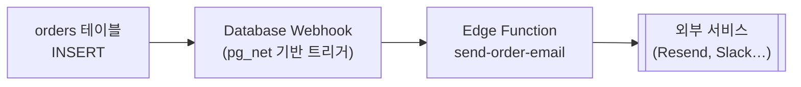

# 10. Edge Functions

서버 코드가 필요한 순간

---

## Edge Functions란

<v-clicks>

- **Deno 런타임** 기반의 서버리스 함수. TypeScript를 그대로 실행한다
- 전 세계 엣지 로케이션에 배포되어 사용자와 가까운 곳에서 실행된다
- `https://<ref>.supabase.co/functions/v1/<함수명>` 으로 호출된다
- **secret key를 안전하게 쓸 수 있는 자리**다 — 브라우저에 둘 수 없는 것들이 여기 온다

</v-clicks>

<v-click>

주 용도:

- 외부 API 호출 (결제, 이메일, LLM) — API 키가 필요한 것
- 웹훅 수신 (Stripe, GitHub 등) — 서명 검증 후 DB 반영
- 관리자 작업 — RLS를 우회해야 하는 일괄 처리
- Auth Hook의 HTTP 구현체

</v-click>

---

## 첫 함수 만들기

```bash
supabase functions new hello-world
```

```text
supabase/functions/
├── hello-world/
│   └── index.ts
└── _shared/            # 여러 함수가 공유하는 코드 (관례)
    └── cors.ts
```

```ts
// supabase/functions/hello-world/index.ts
import { withSupabase } from 'jsr:@supabase/functions-js'

export default {
  fetch: withSupabase({ auth: ['publishable', 'secret'] }, async (req, ctx) => {
    const { name } = await req.json()
    return Response.json({ message: `안녕하세요 ${name}님!` })
  }),
}
```

<v-click>

`withSupabase`는 API 키 검증과 Supabase 클라이언트 생성을 대신 해준다.
기존 예제에서 흔히 보이는 `Deno.serve(async (req) => {...})` 형태도 여전히 동작한다.

</v-click>

---

## 로컬 실행과 배포

```bash
# 로컬 실행 (Docker 필요, 핫 리로드 지원)
supabase functions serve hello-world

# 호출해 보기
curl -i --location --request POST 'http://127.0.0.1:54321/functions/v1/hello-world' \
  --header 'Authorization: Bearer <로컬 anon key>' \
  --header 'Content-Type: application/json' \
  --data '{"name":"앨리스"}'

# 배포
supabase functions deploy hello-world

# 전체 배포 / 목록 / 삭제
supabase functions deploy
supabase functions list
supabase functions delete hello-world
```

<v-click>

**로그 확인:** 대시보드 Edge Functions → 함수 선택 → Logs.
`console.log`가 여기로 나온다. 로컬에서는 터미널에 바로 찍힌다.

</v-click>

---

## 호출 방법

```ts
// supabase-js — 현재 사용자의 JWT가 자동으로 실린다
const { data, error } = await supabase.functions.invoke('hello-world', {
  body: { name: 'JavaScript' },
})

// 헤더 추가 / 메서드 지정
await supabase.functions.invoke('report', {
  method: 'POST',
  headers: { 'x-trace-id': traceId },
  body: { month: '2026-08' },
})
```

```ts
// 순수 fetch
const res = await fetch(`${SUPABASE_URL}/functions/v1/hello-world`, {
  method: 'POST',
  headers: {
    apikey: PUBLISHABLE_KEY,
    Authorization: `Bearer ${session.access_token}`,
    'Content-Type': 'application/json',
  },
  body: JSON.stringify({ name: 'Fetch' }),
})
```

<v-click>

`functions.invoke`는 **HTTP 에러도 `error`로 돌려준다.** `error.context`에 응답 객체가 들어 있다.

</v-click>

---

## 시크릿(환경 변수) 관리

```bash
# .env 파일로 한 번에 등록
supabase secrets set --env-file ./supabase/functions/.env

# 개별 등록
supabase secrets set OPENAI_API_KEY=sk-xxxx STRIPE_SECRET=sk_live_xxxx

# 목록 확인 (값은 해시로만 보인다)
supabase secrets list
```

```ts
const apiKey = Deno.env.get('OPENAI_API_KEY')
```

<v-clicks>

기본으로 주입되는 값들:

- `SUPABASE_URL`
- `SUPABASE_PUBLISHABLE_KEY` (구: `SUPABASE_ANON_KEY`)
- `SUPABASE_SECRET_KEY` (구: `SUPABASE_SERVICE_ROLE_KEY`)
- `SUPABASE_DB_URL`

**`supabase/functions/.env`는 반드시 `.gitignore`에 넣는다.**

</v-clicks>

---

## 함수 안에서 DB 접근 — 두 가지 방식

```ts {1-12|14-22|all}
// 방식 A: 호출자의 권한으로 (RLS 적용) — 기본으로 삼을 것
import { createClient } from 'jsr:@supabase/supabase-js@2'

const supabase = createClient(
  Deno.env.get('SUPABASE_URL')!,
  Deno.env.get('SUPABASE_PUBLISHABLE_KEY')!,
  { global: { headers: { Authorization: req.headers.get('Authorization')! } } },
)
const { data: { user } } = await supabase.auth.getUser()
// 이 클라이언트의 쿼리에는 RLS가 적용된다

// 방식 B: 관리자 권한으로 (RLS 우회) — 꼭 필요할 때만
const admin = createClient(
  Deno.env.get('SUPABASE_URL')!,
  Deno.env.get('SUPABASE_SECRET_KEY')!,
  { auth: { persistSession: false } },
)
await admin.from('audit_logs').insert({ action: 'export', user_id: user.id })
```

<v-click>

**규칙:** 기본은 A. B를 쓸 때는 **함수 안에서 직접 권한을 검증**한 뒤에만 쓴다.
"Edge Function이니까 안전하다"는 착각이 가장 위험하다. 함수 URL은 공개되어 있다.

</v-click>

---

## JWT 검증과 인가

<v-clicks>

- 기본적으로 게이트웨이가 `Authorization` 헤더의 JWT를 검증한다
- 웹훅처럼 **외부에서 JWT 없이 호출**해야 하는 함수는 이 검증을 꺼야 한다

</v-clicks>

<v-click>

```toml
# supabase/config.toml
[functions.stripe-webhook]
verify_jwt = false
```

```bash
# 또는 배포 시 플래그로
supabase functions deploy stripe-webhook --no-verify-jwt
```

</v-click>

<v-click>

**JWT 검증을 끈 함수는 인터넷에 완전히 열려 있다.** 반드시 자체 검증을 넣는다.

```ts
// Stripe 웹훅 서명 검증
const sig = req.headers.get('stripe-signature')!
const event = await stripe.webhooks.constructEventAsync(
  await req.text(), sig, Deno.env.get('STRIPE_WEBHOOK_SECRET')!,
)
```

</v-click>

---

## 의존성 관리

```ts
// npm 패키지 — npm: 접두사
import Stripe from 'npm:stripe@17'
import { Resend } from 'npm:resend'

// JSR (Deno의 표준 레지스트리)
import { createClient } from 'jsr:@supabase/supabase-js@2'

// Deno 표준 라이브러리
import { encodeBase64 } from 'jsr:@std/encoding/base64'
```

```json
// supabase/functions/deno.json — import map으로 정리하면 관리가 편하다
{
  "imports": {
    "@supabase/supabase-js": "jsr:@supabase/supabase-js@2",
    "stripe": "npm:stripe@17"
  }
}
```

<v-clicks>

- **Node 전용 API에 의존하는 패키지는 동작하지 않을 수 있다** (`fs`, `child_process` 등)
- 버전을 반드시 고정한다. 고정하지 않으면 배포마다 다른 버전이 올라갈 수 있다
- 번들 크기가 크면 콜드 스타트가 느려진다

</v-clicks>

---

## CORS 처리

브라우저에서 직접 호출한다면 반드시 필요하다.

```ts
// supabase/functions/_shared/cors.ts
export const corsHeaders = {
  'Access-Control-Allow-Origin': '*',        // 프로덕션에서는 실제 도메인으로 좁힐 것
  'Access-Control-Allow-Headers':
    'authorization, x-client-info, apikey, content-type',
  'Access-Control-Allow-Methods': 'POST, OPTIONS',
}
```

```ts
Deno.serve(async (req) => {
  // preflight 요청 처리 — 빠뜨리면 브라우저에서 호출이 실패한다
  if (req.method === 'OPTIONS') return new Response('ok', { headers: corsHeaders })

  const data = { message: 'hello' }
  return new Response(JSON.stringify(data), {
    headers: { ...corsHeaders, 'Content-Type': 'application/json' },
  })
})
```

---

## Database Webhooks와 연동

DB 변경을 계기로 함수를 자동 실행한다.



<v-clicks>

- 대시보드 **Database → Webhooks** 에서 테이블·이벤트·대상 URL을 설정한다
- 내부적으로는 `pg_net` 확장을 쓰는 트리거다 — **비동기 HTTP 호출**이라 DB 트랜잭션을 막지 않는다
- 재시도 정책이 제한적이므로 **중요한 작업은 큐(pgmq)를 거치게** 설계한다

</v-clicks>

<v-click>

주의: 웹훅은 "적어도 한 번" 보장에 가깝다. **함수를 멱등(idempotent)하게** 만들어야 한다.

</v-click>

---

## 언제 Edge Function을 쓰나

<div class="grid grid-cols-2 gap-6 pt-2">
<div>

**쓰기 좋은 경우**

- DB 이벤트에 반응하는 로직 (웹훅 수신자)
- Auth Hook의 HTTP 구현
- 여러 클라이언트(웹·모바일·서버)가 공유하는 로직
- 프론트엔드 배포와 무관하게 살아야 하는 로직
- Supabase 시크릿만 필요한 작업

</div>
<div>

**Vercel 쪽이 나은 경우**

- 프론트엔드와 강하게 결합된 로직
- 렌더링과 함께 실행되는 데이터 조회
- Node 전용 패키지가 필요한 작업
- 프레임워크 기능(스트리밍, 캐시 태그)을 쓰는 경우
- 팀의 배포 파이프라인이 이미 Vercel 중심일 때

</div>
</div>

<v-click>

**12장에서 이 판단 기준을 훨씬 자세히 다룬다.** 지금은 "둘 다 서버 코드를 둘 수 있다"만 기억하자.

</v-click>

---

## 제약과 함정

<v-clicks>

1. **콜드 스타트** — 오래 호출이 없으면 첫 요청이 느리다. 무거운 import를 줄인다
2. **실행 시간 제한** — 장시간 작업에는 부적합. 큐에 넣고 백그라운드로 넘긴다
3. **JWT 검증을 끄고 자체 검증을 잊음** — 가장 흔한 보안 사고
4. **secret key를 무비판적으로 사용** — 함수 URL은 공개되어 있다는 전제로 설계한다
5. **CORS preflight 미처리** — 브라우저에서만 실패한다
6. **Node 전용 패키지 사용** — 로컬에서는 되고 배포 후 깨지는 경우가 있다
7. **로컬과 배포 환경의 시크릿 불일치** — `secrets set`을 잊으면 배포본만 실패한다
8. **함수가 비멱등** — 웹훅 재시도 시 중복 처리된다

</v-clicks>

---

## 10장 요약

<v-clicks>

- Edge Functions = Deno 서버리스. **시크릿이 필요한 코드의 자리**
- `functions new` → `functions serve`(로컬) → `functions deploy`
- DB 접근은 **호출자 권한(RLS 적용)이 기본**, secret key는 검증 후에만
- `verify_jwt = false`로 열었다면 **반드시 자체 검증**을 넣는다
- 웹훅 연동 시 함수는 멱등하게 만든다
- Vercel Route Handler와 역할이 겹친다 → 다음다음 장(12장)에서 정리

</v-clicks>
