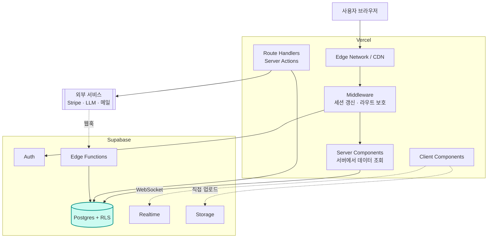
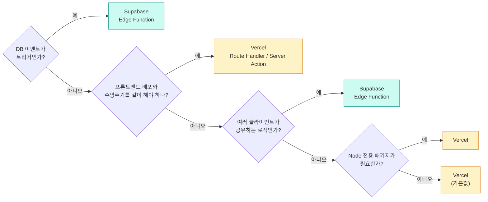
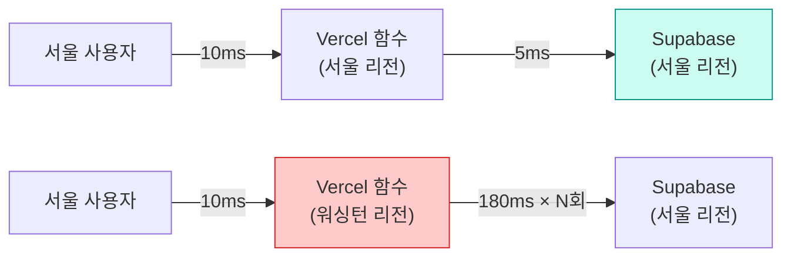
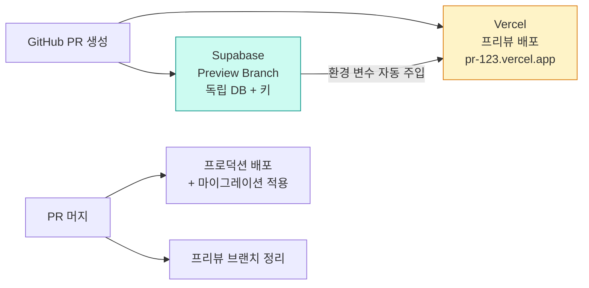
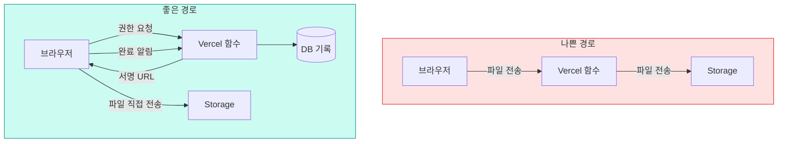

# 12. Vercel과의 역할 배분

무엇을 어디에 둘 것인가

---

## 흔한 오해 — 둘은 경쟁 관계인가

<v-clicks>

두 회사 모두 "백엔드도 됩니다"라고 말하기 때문에 생기는 혼란이다.

- Vercel: Functions, Postgres 파트너 제품, Blob, KV, Cron, AI SDK…
- Supabase: Edge Functions, Cron, Queues, Storage, Vector…

</v-clicks>

<v-click>

<div class="pt-6 text-xl leading-relaxed">
하지만 <strong>본질은 명확하게 다르다.</strong><br><br>
Vercel은 <strong>코드를 실행</strong>하는 회사이고,<br>
Supabase는 <strong>상태를 보관</strong>하는 회사다.
</div>

</v-click>

<v-click>

겹치는 건 "서버 코드를 어디에 둘까" 하나뿐이고, 그건 판단 기준만 세우면 된다.

</v-click>

---

## 한 문장 역할 배분

<div class="grid grid-cols-2 gap-6 pt-6">
<div class="p-5 rounded-lg" style="background: rgba(0,0,0,0.03)">

### Vercel = 실행 계층

- 프론트엔드 빌드와 배포
- 렌더링 (SSR/SSG/ISR/스트리밍)
- CDN과 엣지 캐싱
- 요청 단위로 짧게 사는 서버 코드
- 프리뷰 배포와 팀 협업

</div>
<div class="p-5 rounded-lg" style="background: rgba(13,148,136,0.08)">

### Supabase = 상태 계층

- 데이터 (Postgres)
- 사용자 신원 (Auth)
- 파일 (Storage)
- 실시간 연결 (Realtime)
- 권한 규칙 (RLS)

</div>
</div>

<v-click>

<div class="pt-6 text-center">
<strong>Vercel은 껐다 켜도 데이터가 안 사라진다. Supabase는 사라진다.</strong><br>
<span class="text-sm opacity-70">이 비대칭이 모든 판단의 출발점이다.</span>
</div>

</v-click>

---

## Vercel이 잘하는 것

<v-clicks>

- **프레임워크 통합** — Next.js를 만든 회사다. App Router, Server Components, 스트리밍이 최적화되어 있다
- **글로벌 CDN** — 정적 자산과 캐시된 페이지를 사용자 가까이에서 서빙
- **프리뷰 배포** — PR마다 고유 URL. 코드 리뷰의 절반이 여기서 끝난다
- **이미지 최적화** — `next/image`가 자동으로 포맷 변환·리사이즈·캐싱
- **미들웨어** — 요청이 라우트에 닿기 전에 개입 (인증 리다이렉트, A/B 테스트)
- **관측성** — Analytics, Speed Insights, 로그 드레인
- **빌드 파이프라인** — git push → 빌드 → 배포가 설정 없이 돌아간다

</v-clicks>

---

## Supabase가 잘하는 것

<v-clicks>

- **영속 데이터** — 관계형, 트랜잭션, 제약, 인덱스가 있는 진짜 데이터베이스
- **행 단위 권한(RLS)** — 접근 경로가 늘어나도 규칙은 한 곳에만 존재
- **완결된 인증** — 소셜, MFA, SSO, 세션 관리까지 제품으로 제공
- **상태 있는 연결(Realtime)** — WebSocket은 서버리스 함수가 잘 못 하는 영역이다
- **파일 저장과 서빙** — 권한이 걸린 파일을 CDN으로
- **DB 내장 기능** — cron, 큐, 벡터 검색, 외부 데이터 연동

</v-clicks>

<v-click>

**주목:** WebSocket과 영속 연결은 서버리스와 근본적으로 궁합이 나쁘다.
Realtime을 Supabase가 맡는 건 취향이 아니라 구조적 필연이다.

</v-click>

---
class: dense
---

## 겹치는 영역 지도

| 기능 | Vercel | Supabase | 판단 |
|---|---|---|---|
| 서버 함수 | Route Handler / Server Action | Edge Functions | **상황에 따라** (뒤에서 상세히) |
| 스케줄 작업 | Vercel Cron | pg_cron | DB 작업이면 Supabase |
| 큐 | Vercel Queues | pgmq | DB 트랜잭션과 묶이면 Supabase |
| 파일 저장 | Blob | Storage | **권한이 필요하면 Supabase** |
| KV 캐시 | Vercel KV | (Postgres/외부) | 세션 캐시는 Vercel |
| 이미지 최적화 | `next/image` | Storage 변환 | **한 쪽만 쓴다** (중복 과금) |
| 인증 | (직접 구현) | Auth | **Supabase** |
| DB | 파트너 Postgres | Postgres | **Supabase** (통합 이점) |

<v-click>

**원칙: 하나의 책임에 두 시스템을 동시에 쓰지 않는다.** 특히 이미지 최적화와 캐시가 그렇다.

</v-click>

---

## 표준 아키텍처 한 장



---

## 요청 흐름 3종

<v-clicks>

**1. 서버 렌더링 조회** — 페이지를 열 때
`브라우저 → Vercel(RSC) → Supabase REST → Postgres(RLS) → HTML 응답`
장점: 초기 로딩이 빠르고 SEO에 유리. 쿠키의 JWT가 그대로 전달된다.

**2. 클라이언트 직접 조회** — 인터랙션·무한 스크롤
`브라우저 → Supabase REST → Postgres(RLS)`
장점: Vercel 함수 실행 비용이 들지 않는다. **Vercel을 아예 거치지 않는다.**

**3. 서버 액션 / Route Handler** — 결제, 외부 API, 복합 로직
`브라우저 → Vercel 함수 → (Supabase + 외부 API) → 응답`
장점: 시크릿을 쓸 수 있고, 여러 작업을 조율할 수 있다.

</v-clicks>

<v-click>

**세 가지를 다 쓰는 게 정상이다.** 하나로 통일하려 하지 말 것.

</v-click>

---

## 판단 기준 (1) — 서버 로직을 어디에 둘까



<v-click>

**기본값은 Vercel이다.** 이미 그 레포에서 개발하고 배포하고 있기 때문이다.
Supabase Edge Function은 "이유가 있을 때" 선택한다.

</v-click>

---
class: dense
---

## 판단 기준 (2) — 비교표

| | Vercel Route Handler | Supabase Edge Function |
|---|---|---|
| 런타임 | Node.js 또는 Edge | Deno |
| 배포 단위 | **프론트엔드와 함께** | 독립 |
| 코드 위치 | 같은 레포, 같은 타입 | `supabase/functions/` |
| 타입 공유 | ○ (같은 프로젝트) | 별도 관리 필요 |
| DB 근접성 | 리전 설정에 따름 | **DB와 가까움** |
| 프리뷰 배포 | **PR마다 자동** | 브랜치 연동 필요 |
| DB 웹훅 대상 | 가능하지만 우회적 | **자연스러움** |
| Node 패키지 | **전부 사용 가능** | 제한적 |
| 시크릿 관리 | Vercel 환경 변수 | `supabase secrets` |
| 콜드 스타트 | 있음 | 있음 |

---
class: denser
---

## 판단 기준 (3) — 실제 사례로 배치해보기

| 하는 일 | 배치 | 이유 |
|---|---|---|
| 상품 목록 페이지 렌더링 | **Vercel RSC** | 렌더링과 조회가 붙어 있다 |
| 무한 스크롤 추가 로딩 | **브라우저 → Supabase 직접** | Vercel 함수 비용 절약 |
| 결제 세션 생성 | **Vercel Route Handler** | Stripe 시크릿 + 프론트 흐름과 결합 |
| Stripe 웹훅 수신 | **Supabase Edge Function** | 프론트 배포와 무관하게 살아야 |
| 회원가입 시 프로필 생성 | **Postgres 트리거** | DB 안에서 원자적으로 |
| 가입 환영 메일 | **Supabase Edge Function** | DB 이벤트가 트리거 |
| 채팅 메시지 수신 | **Supabase Realtime** | WebSocket은 서버리스가 못 한다 |
| 이미지 업로드 | **브라우저 → Storage 직접** | Vercel 함수 본문 크기 제한 회피 |
| 야간 집계 배치 | **pg_cron** | DB 안에서 완결 |
| OG 이미지 생성 | **Vercel** | 프레임워크 기능 |

---

## 데이터 접근 경로 선택 — Data API vs 직접 연결

<div class="grid grid-cols-2 gap-6 pt-2">
<div>

**Data API (PostgREST)**

```ts
supabase.from('posts').select()
```

- HTTP → **커넥션 풀 걱정 없음**
- **RLS가 자동 적용**
- 브라우저에서도 동일하게 사용
- 복잡한 쿼리는 RPC로

</div>
<div>

**직접 연결 (Prisma/Drizzle)**

```ts
db.select().from(posts)
```

- 익숙한 ORM, 마이그레이션 도구
- 복잡한 쿼리·트랜잭션 자유
- **Supavisor transaction 모드(6543) 필수**
- **RLS가 적용되지 않는다** (기본적으로)

</div>
</div>

<v-clicks>

**추천 조합**

- 사용자가 자기 데이터를 다루는 경로 → **Data API + RLS**
- 관리자 도구, 배치, 복잡한 리포트 → **직접 연결**
- 둘을 섞을 때는 **"어느 경로에는 RLS가 없다"** 를 팀 전체가 알고 있어야 한다

</v-clicks>

---

## 리전 배치 — 지연 시간의 핵심



<v-clicks>

- **함수와 DB가 멀면 왕복마다 대가를 치른다.** 한 페이지에 쿼리 5개면 5배로 곱해진다
- Next.js 프로젝트라면 `vercel.json`이나 프로젝트 설정에서 **함수 리전을 DB 리전에 맞춘다**

```json
{ "functions": { "app/**": { "maxDuration": 30 } }, "regions": ["icn1"] }
```

- **Edge 런타임은 사용자에게는 가깝지만 DB에서는 멀 수 있다.** DB를 많이 읽는 라우트는 Node 런타임 + DB 리전이 낫다

</v-clicks>

---

## 캐싱 역할 분담

<v-clicks>

**Vercel이 담당**

- 정적 자산, 빌드 결과물 (CDN)
- ISR / `revalidate` 로 페이지 캐시
- `fetch` 캐시, Data Cache, 태그 기반 무효화

**Supabase가 담당**

- Storage 파일의 CDN 캐시 (`cacheControl`)
- 이미지 변환 결과 캐시

</v-clicks>

<v-click>

**주의점 두 가지**

1. 사용자별로 다른 데이터(RLS 결과)를 **페이지 캐시에 넣으면 안 된다** — 다른 사람에게 노출된다
2. 인증이 필요한 라우트에는 `export const dynamic = 'force-dynamic'` 또는 `noStore()`를 명시하자

</v-click>

---

## 환경 변수 배치

```bash
# Vercel — 클라이언트에도 노출 (브라우저 번들 포함)
NEXT_PUBLIC_SUPABASE_URL=https://<ref>.supabase.co
NEXT_PUBLIC_SUPABASE_PUBLISHABLE_KEY=sb_publishable_xxx

# Vercel — 서버 전용
SUPABASE_SECRET_KEY=sb_secret_xxx
STRIPE_SECRET_KEY=sk_live_xxx
DATABASE_URL=postgres://...pooler.supabase.com:6543/postgres   # 직접 연결용

# Supabase — Edge Function 전용
supabase secrets set RESEND_API_KEY=re_xxx
```

<v-clicks>

- **`NEXT_PUBLIC_` 접두사 = 공개**라고 외운다. 여기 secret이 들어가면 즉시 사고다
- Vercel은 Production / Preview / Development 환경별로 값을 나눌 수 있다
- 프리뷰 환경은 **별도 Supabase 프로젝트나 브랜치**를 가리키게 하는 것이 안전하다

</v-clicks>

---

## Vercel 통합 — 두 가지 연결 방식

<v-clicks>

**A) Vercel Marketplace 네이티브 통합** (Public Alpha)
- Vercel 안에서 Supabase 리소스를 만들고 관리한다
- **통합 청구** — Vercel 요금에 합산된다
- 인증과 팀 접근 권한이 Vercel 쪽에서 관리된다

**B) 수동 연결 (직접 환경 변수 설정)**
- Supabase에서 프로젝트를 만들고, 키를 Vercel 환경 변수에 붙여넣는다
- 가장 단순하고 통제가 명확하다
- **팀이 이미 Supabase 대시보드를 쓰고 있다면 이쪽이 자연스럽다**

</v-clicks>

<v-click>

통합을 쓰면 다음 변수들이 자동으로 주입된다:
`SUPABASE_URL`, `NEXT_PUBLIC_SUPABASE_URL`, `SUPABASE_PUBLISHABLE_KEY`,
`NEXT_PUBLIC_SUPABASE_PUBLISHABLE_KEY`, `SUPABASE_SECRET_KEY`,
`POSTGRES_URL`, `POSTGRES_PRISMA_URL`, `POSTGRES_URL_NON_POOLING` 등

</v-click>

---

## 프리뷰 배포와 Supabase 브랜치 매핑



<v-clicks>

- **각 PR이 자체 DB를 갖는다** — 스키마 변경을 안전하게 테스트할 수 있다
- 환경 변수 동기화는 **브랜치 생성 시점이 아니라 PR이 열리는 시점**에 일어난다
- 프리뷰 브랜치는 **데이터를 복사하지 않는다.** 시드 파일로 채워야 한다
- 프리뷰 브랜치는 시간당 과금된다 (예: 브랜치당 $0.01344/시간)

</v-clicks>

---

## Auth Redirect URL과 프리뷰 문제

프리뷰 배포에서 소셜 로그인이 깨지는 대표적 원인.

<v-clicks>

**문제:** Vercel 프리뷰 URL은 배포마다 바뀐다 (`myapp-git-feat-x-team.vercel.app`).
Supabase의 Redirect URL 허용 목록에 없으면 로그인 후 리다이렉트가 거부된다.

**해결 1: 와일드카드 등록**

```text
https://*-myteam.vercel.app/**
https://myapp-*.vercel.app/**
```

**해결 2: 콜백에서 원래 주소로 되돌리기**

```ts
const origin = request.headers.get('origin')
const forwardedHost = request.headers.get('x-forwarded-host')   // Vercel이 붙여준다
const redirectBase = process.env.NODE_ENV === 'development'
  ? origin
  : `https://${forwardedHost}`
```

</v-clicks>

<v-click>

**해결 3:** 프리뷰에도 고정 도메인을 할당한다 (브랜치별 별칭 도메인).

</v-click>

---
class: denser
---

## 비용 관점의 역할 배분

<v-clicks>

**Vercel의 비용 동인**
- 함수 실행 시간과 호출 수
- 대역폭 (전송량)
- 이미지 최적화 횟수
- 빌드 시간

**Supabase의 비용 동인**
- 컴퓨트 크기 (상시 과금)
- 대역폭 (egress)
- 스토리지 용량
- MAU

</v-clicks>

<v-click>

**돈이 되는 판단들**

- **클라이언트에서 Supabase로 직접 조회**하면 Vercel 함수 비용이 0이다
- 반대로 **모든 조회를 RSC로 하면** Vercel 함수 실행 시간이 늘어난다
- 이미지 최적화는 **한 쪽에서만** 한다 — 양쪽 다 하면 양쪽에 과금된다
- 파일은 브라우저에서 Storage로 **직접** 올린다 — Vercel 대역폭을 소비하지 않는다

</v-click>

---

## 파일 업로드 경로 설계



<v-clicks>

나쁜 경로의 문제: 요청 본문 크기 제한, 함수 실행 시간 제한, **양쪽 대역폭 이중 과금**

좋은 경로: 서버는 **권한 판단과 기록만** 하고, 바이트는 지나가지 않는다

</v-clicks>

---

## Vercel 없이 Supabase를 쓰는 경우

<v-clicks>

Supabase는 Vercel 전용이 아니다.

- **Cloudflare Pages / Workers** — 엣지 실행, 저렴한 대역폭
- **Netlify** — Vercel과 유사한 모델
- **Fly.io / Railway / Render** — 상시 실행 서버. **커넥션 풀을 직접 관리**할 수 있어 ORM 직접 연결에 유리
- **모바일 앱 (Flutter, Swift, Kotlin)** — 프론트엔드가 아예 없다. Supabase가 유일한 백엔드
- **정적 사이트 + 클라이언트 전용** — Astro/Vite SPA가 브라우저에서 직접 호출

</v-clicks>

<v-click>

**상시 실행 서버를 쓴다면** 서버리스 특유의 제약(커넥션 폭발, 콜드 스타트, WebSocket 불가)이 사라진다.
그 경우 Supabase를 "그냥 관리형 Postgres"로만 써도 충분히 합리적이다.

</v-click>

---

## 안티패턴 모음

<v-clicks>

1. **모든 조회를 Vercel 함수로 프록시** — 지연 시간과 비용이 두 배. 클라이언트 직접 조회를 활용하자
2. **secret key로 서버에서 모든 걸 처리하고 RLS를 안 씀** — 권한 로직이 앱 코드로 흩어진다
3. **함수 리전과 DB 리전이 대륙 단위로 다름** — 가장 흔한 성능 문제
4. **Prisma 직접 연결에 RLS를 기대** — 적용되지 않는다
5. **프리뷰와 프로덕션이 같은 DB** — 프리뷰에서 프로덕션 데이터를 지운다
6. **프리뷰 URL을 Redirect 목록에 안 넣음** — 로그인 테스트가 불가능해진다
7. **파일을 Vercel 함수로 중계** — 크기 제한과 이중 과금
8. **`next/image`와 Storage 변환을 동시에** — 양쪽에 과금
9. **사용자별 데이터를 ISR 캐시에 저장** — 데이터 유출
10. **직접 연결 포트를 5432(direct)로 두고 서버리스 배포** — 커넥션 고갈

</v-clicks>

---

## 12장 요약

<v-clicks>

<div class="text-lg">
<strong>Vercel = 실행, Supabase = 상태.</strong> 이 한 줄이 대부분의 판단을 해결한다.
</div>

- 서버 로직의 **기본값은 Vercel**, DB 이벤트가 트리거이거나 프론트 배포와 분리돼야 하면 Supabase
- 사용자 데이터 CRUD는 **Data API + RLS**, 관리자/배치는 직접 연결
- **리전을 맞춘다.** 함수와 DB가 멀면 모든 쿼리에 세금이 붙는다
- 파일과 실시간은 **브라우저 ↔ Supabase 직접 연결**이 정답이다
- 프리뷰 환경은 **별도 브랜치/프로젝트**로 분리하고, Redirect URL 와일드카드를 잊지 않는다

</v-clicks>
