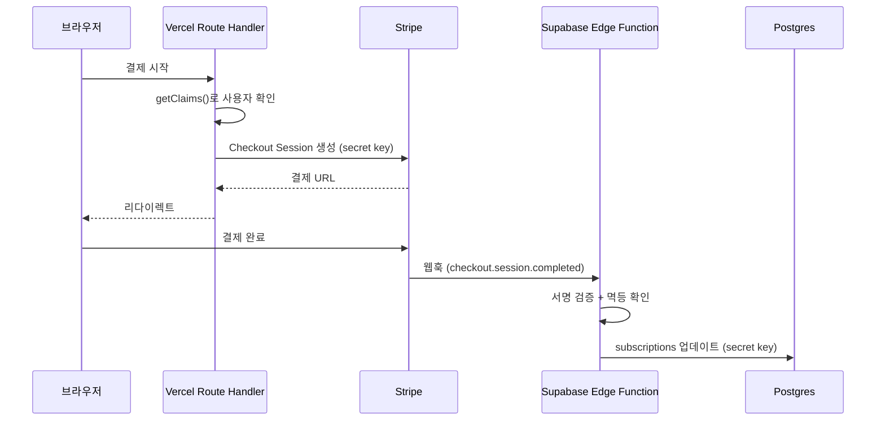
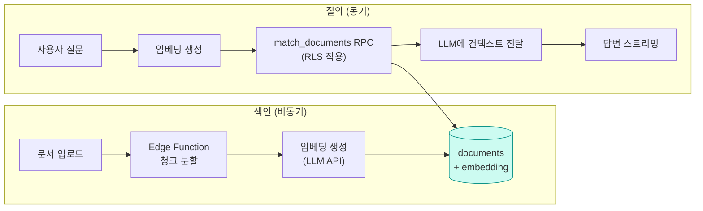

# 16. 실전 패턴과 안티패턴

배운 것을 조합하기

---

## 시나리오 1 — 멀티테넌트 SaaS (스키마)

```sql
create table public.organizations (
  id         uuid primary key default gen_random_uuid(),
  name       text not null,
  slug       text not null unique,
  created_at timestamptz not null default now()
);

create table public.org_members (
  org_id  uuid not null references public.organizations (id) on delete cascade,
  user_id uuid not null references auth.users (id) on delete cascade,
  role    text not null default 'member' check (role in ('owner','admin','member')),
  primary key (org_id, user_id)
);
create index org_members_user_idx on public.org_members (user_id);

-- 모든 업무 테이블은 org_id를 갖는다 (테넌트 키)
create table public.projects (
  id      uuid primary key default gen_random_uuid(),
  org_id  uuid not null references public.organizations (id) on delete cascade,
  name    text not null
);
create index projects_org_idx on public.projects (org_id);
```

<v-click>

**핵심 원칙: 모든 테넌트 데이터에 `org_id`를 둔다.** 조인으로 유추하지 않는다.

</v-click>

---
class: dense
---

## 시나리오 1 — RLS 헬퍼 함수

정책이 참조하는 `org_members`에도 RLS가 걸리므로, 헬퍼로 한 번 감싼다.

```sql
create schema if not exists private;

-- 내가 속한 조직 목록
create or replace function private.my_orgs()
returns setof uuid
language sql stable security definer set search_path = ''
as $$
  select org_id from public.org_members where user_id = auth.uid();
$$;

-- 특정 조직에서의 내 역할
create or replace function private.my_role(target_org uuid)
returns text
language sql stable security definer set search_path = ''
as $$
  select role from public.org_members
  where user_id = auth.uid() and org_id = target_org;
$$;
```

<v-click>

`security definer`로 RLS 재귀를 끊고, `stable`로 쿼리당 결과를 캐시한다.

</v-click>

---
class: dense
---

## 시나리오 1 — 정책 적용

```sql
alter table public.projects enable row level security;

create policy "조직 멤버는 조회"
  on public.projects for select to authenticated
  using ( org_id in (select private.my_orgs()) );

create policy "admin 이상만 생성"
  on public.projects for insert to authenticated
  with check ( private.my_role(org_id) in ('owner','admin') );

create policy "admin 이상만 수정/삭제"
  on public.projects for all to authenticated
  using ( private.my_role(org_id) in ('owner','admin') )
  with check ( private.my_role(org_id) in ('owner','admin') );
```

<v-click>

**모든 테넌트 테이블이 이 두 함수만 참조**하게 만드는 것이 핵심이다.
멤버십 규칙이 바뀌어도 고칠 곳이 두 군데뿐이다.

</v-click>

---

## 시나리오 1 — 초대 플로우

```sql
create table public.invitations (
  id         uuid primary key default gen_random_uuid(),
  org_id     uuid not null references public.organizations (id) on delete cascade,
  email      text not null,
  role       text not null default 'member',
  token      text not null unique default encode(gen_random_bytes(24), 'hex'),
  expires_at timestamptz not null default now() + interval '7 days',
  accepted_at timestamptz,
  unique (org_id, email)
);
```

<v-clicks>

**흐름**

1. admin이 초대 생성 → 트리거가 Edge Function 호출 → 초대 메일 발송
2. 수신자가 링크 클릭 → 로그인/가입
3. 가입 후 RPC 호출 (`accept_invitation(token)`) → `org_members`에 추가

**RPC로 처리하는 이유:** 토큰 검증 + 만료 확인 + 멤버 추가 + 초대 소진을
**하나의 트랜잭션**으로 처리해야 하기 때문이다.

</v-clicks>

---
class: denser
---

## 시나리오 2 — 실시간 채팅 (스키마와 정책)

```sql
-- rooms(id, name) / room_members(room_id, user_id) 는 생략

create table public.messages (
  id         bigint generated always as identity primary key,
  room_id    uuid not null references public.rooms (id) on delete cascade,
  user_id    uuid not null default auth.uid() references auth.users (id),
  body       text not null check (char_length(body) between 1 and 4000),
  created_at timestamptz not null default now()
);
create index messages_room_created_idx on public.messages (room_id, created_at desc);

alter table public.messages enable row level security;

create policy "방 참여자만 조회" on public.messages for select to authenticated
  using ( room_id in (
    select room_id from public.room_members where user_id = (select auth.uid())
  ) );

create policy "방 참여자만 전송" on public.messages for insert to authenticated
  with check ( room_id in (
    select room_id from public.room_members where user_id = (select auth.uid())
  ) );
```

---

## 시나리오 2 — 전송과 구독

```ts
// 초기 로딩은 Server Component에서
const { data: initial } = await supabase
  .from('messages')
  .select('id, body, created_at, profiles ( username )')
  .eq('room_id', roomId)
  .order('created_at', { ascending: false })
  .limit(50)
```

```ts
'use client'
// 구독 + 타이핑 표시(Broadcast) + 접속자(Presence)를 한 채널에서
const channel = supabase.channel(`room:${roomId}`, { config: { private: true } })
  .on('postgres_changes',
      { event: 'INSERT', schema: 'public', table: 'messages',
        filter: `room_id=eq.${roomId}` },
      ({ new: m }) => append(m))
  .on('broadcast', { event: 'typing' }, ({ payload }) => showTyping(payload.userId))
  .on('presence', { event: 'sync' }, () => setOnline(channel.presenceState()))
  .subscribe(async s => { if (s === 'SUBSCRIBED') await channel.track({ at: Date.now() }) })
```

<v-click>

**구독자가 수천 명 규모가 되면** `postgres_changes` 대신 트리거 + `realtime.broadcast_changes()`로 전환한다.

</v-click>

---

## 시나리오 3 — 결제 연동 (Stripe)



<v-click>

**왜 결제 시작은 Vercel, 웹훅은 Supabase인가?**
결제 시작은 사용자 세션과 프론트 흐름에 붙어 있다. 웹훅은 프론트 배포와 무관하게
항상 살아 있어야 하고, DB 반영이 목적이다.

</v-click>

---

## 시나리오 3 — 웹훅 처리와 멱등성

```ts
// supabase/functions/stripe-webhook/index.ts  (verify_jwt = false)
Deno.serve(async (req) => {
  const sig = req.headers.get('stripe-signature')
  const raw = await req.text()

  let event
  try {
    event = await stripe.webhooks.constructEventAsync(
      raw, sig!, Deno.env.get('STRIPE_WEBHOOK_SECRET')!,
    )
  } catch {
    return new Response('Invalid signature', { status: 400 })
  }

  // 멱등성: 이미 처리한 이벤트면 조용히 200
  const { error: dup } = await admin
    .from('processed_webhook_events')
    .insert({ id: event.id, type: event.type })
  if (dup?.code === '23505') return new Response('ok (duplicate)', { status: 200 })

  // ... 실제 처리 ...
  return new Response('ok', { status: 200 })
})
```

<v-click>

**유니크 제약 위반(23505)을 멱등성 장치로 쓰는 패턴.** DB가 중복을 막아준다.

</v-click>

---

## 시나리오 4 — 파일 기반 문서 앱

```sql
create table public.documents (
  id         uuid primary key default gen_random_uuid(),
  org_id     uuid not null references public.organizations (id) on delete cascade,
  title      text not null,
  storage_path text not null unique,
  size_bytes bigint,
  created_by uuid not null default auth.uid(),
  created_at timestamptz not null default now()
);

create policy "조직 문서 조회" on public.documents for select to authenticated
  using ( org_id in (select private.my_orgs()) );
```

```sql
-- Storage 정책도 같은 조직 규칙을 따르게
create policy "조직 폴더 접근" on storage.objects for select to authenticated
  using (
    bucket_id = 'documents'
    and (storage.foldername(name))[1] in (select private.my_orgs()::text)
  );
```

<v-click>

**경로 규칙:** `documents/<org_id>/<document_id>.<ext>`
DB 정책과 Storage 정책이 **같은 헬퍼 함수를 공유**하면 규칙이 어긋나지 않는다.

</v-click>

---

## 시나리오 5 — AI 챗봇 (RAG)



<v-clicks>

- **RLS가 그대로 적용된다** — 사용자가 접근 가능한 문서에서만 검색된다. 별도 필터링 코드가 없다
- 색인은 Edge Function + pgmq로 비동기 처리 (문서가 많으면 시간이 걸린다)
- 답변 스트리밍은 **Vercel**(프레임워크 스트리밍 지원)이 유리하다

</v-clicks>

---
class: dense
---

## 감사 로그 패턴 (1) — 테이블

```sql
create table public.audit_logs (
  id         bigint generated always as identity primary key,
  table_name text not null,
  record_id  text not null,
  action     text not null,          -- INSERT | UPDATE | DELETE
  actor_id   uuid,                   -- 누가 했는가
  old_data   jsonb,
  new_data   jsonb,
  created_at timestamptz not null default now()
);

create index audit_logs_record_idx
  on public.audit_logs (table_name, record_id, created_at desc);
```

<v-clicks>

- `jsonb`로 통째로 남기면 **어떤 테이블에도 같은 트리거를 재사용**할 수 있다
- 감사 로그는 빠르게 커진다 — 보관 기간 정책과 정리 배치를 함께 만든다
- RLS: 일반 사용자에게는 노출하지 않는 것이 기본이다

</v-clicks>

---
class: dense
---

## 감사 로그 패턴 (2) — 트리거

```sql
create or replace function public.audit_trigger()
returns trigger language plpgsql security definer set search_path = ''
as $$
begin
  insert into public.audit_logs
    (table_name, record_id, action, actor_id, old_data, new_data)
  values (
    tg_table_name,
    coalesce(new.id, old.id)::text,
    tg_op,
    auth.uid(),
    case when tg_op in ('UPDATE','DELETE') then to_jsonb(old) end,
    case when tg_op in ('INSERT','UPDATE') then to_jsonb(new) end
  );
  return coalesce(new, old);
end;
$$;

create trigger projects_audit
  after insert or update or delete on public.projects
  for each row execute function public.audit_trigger();
```

---

## 소프트 삭제 패턴

```sql
alter table public.projects add column deleted_at timestamptz;
create index projects_alive_idx on public.projects (org_id) where deleted_at is null;

-- restrictive 정책으로 예외 없이 숨긴다
create policy "삭제된 항목 숨김"
  on public.projects as restrictive for select to authenticated
  using ( deleted_at is null );
```

<v-clicks>

- `as restrictive`라 **다른 어떤 정책과도 AND로 결합**된다 → 새 정책을 추가해도 누락되지 않는다
- 관리자가 봐야 한다면 별도 뷰나 `security definer` 함수로 제공한다
- **정기 정리 배치**를 반드시 만든다 — 안 그러면 테이블이 무한정 커진다

```sql
select cron.schedule('purge-deleted', '0 4 * * 0',
  $$ delete from public.projects where deleted_at < now() - interval '30 days' $$);
```

</v-clicks>

---

## 알림 패턴

```sql
create table public.notifications (
  id        bigint generated always as identity primary key,
  user_id   uuid not null references auth.users (id) on delete cascade,
  type      text not null,
  payload   jsonb not null default '{}',
  read_at   timestamptz,
  created_at timestamptz not null default now()
);
create index notifications_unread_idx
  on public.notifications (user_id, created_at desc) where read_at is null;

alter table public.notifications enable row level security;
create policy "본인 알림만" on public.notifications for all to authenticated
  using ( (select auth.uid()) = user_id ) with check ( (select auth.uid()) = user_id );

alter publication supabase_realtime add table public.notifications;
```

<v-click>

**구독 + 저장을 동시에.** 접속 중이면 실시간으로 받고, 접속하지 않았으면 다음에 조회한다.
읽지 않은 알림만 색인하는 **부분 인덱스**가 배지 카운트 쿼리를 빠르게 만든다.

</v-click>

---

## 안티패턴 총정리 (1) — 보안

<v-clicks>

1. **RLS 미적용 테이블** — 인터넷에 공개된 것과 같다
2. **secret key를 클라이언트에** — 프로젝트 전체가 열린다
3. **`user_metadata`로 권한 판단** — 사용자가 직접 수정 가능
4. **서버에서 `getSession()`의 user를 신뢰** — 쿠키는 위조 가능
5. **`security definer` 함수에 `search_path` 미설정** — 스키마 하이재킹
6. **뷰로 RLS 우회** — `security_invoker = on` 누락
7. **`verify_jwt = false` 함수에 자체 검증 없음** — 공개 엔드포인트
8. **소유자 컬럼을 클라이언트가 지정** — `default auth.uid()`를 쓰자
9. **`update` 정책에 `with check` 누락** — 소유권 이전이 가능해진다

</v-clicks>

---

## 안티패턴 총정리 (2) — 설계와 성능

<v-clicks>

1. **인덱스 없는 외래 키 / RLS 비교 컬럼** — 가장 흔한 성능 문제
2. **`auth.uid()`를 `(select ...)`로 안 감쌈** — 행마다 재평가
3. **루프 안 쿼리 (N+1)** — 중첩 select 또는 `.in()`으로
4. **`select('*')` 남용** — 대역폭 비용
5. **깊은 오프셋 페이지네이션** — 커서로 전환
6. **대시보드에서 프로덕션 스키마 직접 수정** — 환경이 갈라진다
7. **여러 supabase-js 호출로 원자성 기대** — RPC로 묶는다
8. **Prisma 직접 연결에 RLS 기대** — 적용되지 않는다
9. **서버리스에서 direct connection(5432)** — 커넥션 고갈
10. **함수 리전과 DB 리전 불일치** — 모든 쿼리에 지연 세금
11. **Realtime 채널 정리 누락** — 구독 누적
12. **사용자별 데이터를 페이지 캐시에** — 데이터 유출

</v-clicks>

---

## 16장 요약

<v-clicks>

- 멀티테넌트는 **모든 테이블에 `org_id`** + 헬퍼 함수 기반 정책
- 정책이 길어지면 **`security definer` 헬퍼로 추출**한다 — 재사용되고 빨라진다
- 웹훅은 **멱등하게**. 유니크 제약을 멱등성 장치로 쓸 수 있다
- Storage 정책과 DB 정책이 **같은 헬퍼를 공유**하면 규칙이 어긋나지 않는다
- RAG에서 RLS가 그대로 걸리는 것이 Supabase의 큰 이점이다
- 안티패턴 목록은 **코드 리뷰 체크리스트**로 쓰자

</v-clicks>
