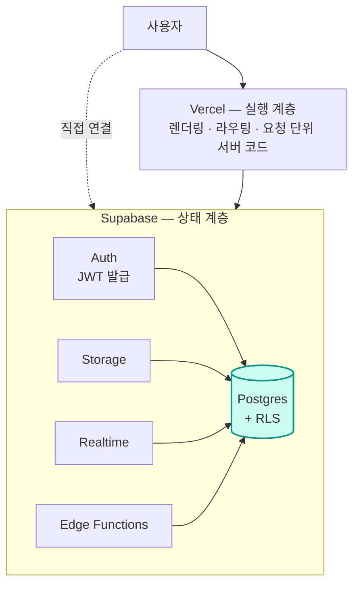

# 17. 정리

무엇을 가져갈 것인가

---

## 전체 그림 되짚기

<v-click>

**한 문장:** Auth가 발급한 JWT를 Postgres의 RLS가 해석해서 행 단위로 접근을 판정한다.
나머지는 전부 그 위에 얹힌 편의 기능이다.

</v-click>

---

## 꼭 기억할 10가지

<v-clicks>

1. **Supabase를 배우는 건 Postgres를 배우는 것이다**
2. **테이블 생성과 `enable row level security`는 한 세트다**
3. `publishable key`는 공개해도 되고, **`secret key`는 절대 안 된다**
4. `auth.uid()`는 **JWT의 `sub`** 이고, RLS의 입력이다
5. `user_metadata`는 사용자가 고칠 수 있다 — **권한 판단에 쓰지 않는다**
6. **RLS 성능 3종:** 역할 명시 · `(select auth.uid())` · 인덱스
7. **Vercel은 실행, Supabase는 상태.** 리전은 맞춘다
8. 스키마의 진실은 **`supabase/migrations/`**, 대시보드가 아니다
9. 서버에서 신원 확인은 **`getClaims()`**, `getSession()`은 신뢰하지 않는다
10. **원자성이 필요하면 RPC로 묶는다**

</v-clicks>

---

## 첫 프로젝트 시작 순서

<v-clicks>

1. `supabase init` → `supabase start` (로컬 스택부터 띄운다)
2. 첫 마이그레이션에 **`profiles` 테이블 + 트리거 + RLS**를 작성한다
3. `supabase db reset`으로 재현성 확인
4. `supabase gen types typescript --local` 을 `package.json` 스크립트로 등록
5. Next.js에 `@supabase/ssr` 클라이언트 4종(브라우저/서버/미들웨어/관리자) 세팅
6. 로그인 → 보호된 페이지 → 데이터 CRUD 한 사이클을 끝까지 만들어 본다
7. 원격 프로젝트 생성 → `supabase link` → CI에서 `db push`
8. Vercel 연결, 환경 변수 3종 세팅, Redirect URL 등록
9. **Security Advisor 경고 0개** 확인
10. 배포

</v-clicks>

---

## 학습 로드맵

<v-clicks>

**1주차 — 감 잡기**
프로젝트 생성, 테이블 만들기, `supabase-js`로 CRUD, 이메일 로그인, RLS 기본 정책 4종.
→ 이 덱의 1~7장.

**1개월차 — 실전 구조**
로컬 개발 + 마이그레이션 흐름 정착, Next.js SSR 통합, Storage, Realtime,
Edge Function 하나 배포, CI 구성.
→ 8~14장.

**3개월차 — 운영 감각**
`explain analyze`로 쿼리 튜닝, RLS 성능 최적화, 브랜칭 워크플로,
비용 모니터링, 백업/복구 리허설, 멀티테넌트 설계.
→ 15~16장 + 실제 트래픽 경험.

</v-clicks>

---

## 참고 자료

<v-clicks>

**공식**
- 문서: `supabase.com/docs`
- 블로그(신기능·릴리스): `supabase.com/blog`
- GitHub: `github.com/supabase/supabase`
- Discord / GitHub Discussions

**같이 보면 좋은 것**
- PostgREST 문서 — Data API의 실체를 이해하는 데 도움된다
- Postgres 공식 문서 — RLS, 인덱스, `explain` 부분
- Next.js 문서 — App Router의 캐싱과 동적 렌더링

**실습**
- `supabase.com/docs/guides/getting-started` 의 프레임워크별 퀵스타트
- 공식 예제 저장소의 `examples/` 디렉터리

</v-clicks>

---

## 자주 받는 질문

<v-clicks>

**Q. Prisma나 Drizzle을 같이 써도 되나?**
된다. 다만 직접 연결에는 RLS가 적용되지 않으니, **서버 전용 경로**로 한정하고
사용자 데이터 접근은 Data API로 하는 조합이 안전하다.

**Q. RLS가 너무 어렵다. 그냥 서버에서 처리하면 안 되나?**
가능하다. 하지만 그러면 **모든 접근 경로에 검증 코드를 복제**해야 한다.
경로가 하나뿐(서버 API만)이라면 합리적인 선택일 수 있다.

**Q. Free 플랜으로 서비스를 운영해도 되나?**
1주일 비활동 시 일시정지되고 백업이 없다. **실사용자가 있으면 최소 Pro**를 권한다.

**Q. 셀프호스팅이 현실적인가?**
가능하지만 Postgres 운영 경험이 필요하다. 대부분의 팀에는 관리형이 더 저렴하다.

</v-clicks>

---

## 마무리

Supabase의 가치는 "백엔드를 안 만들어도 된다"가 아니라 
<strong>"백엔드의 반복되는 부분을 데이터베이스에 위임하고 
정말 중요한 로직에 집중할 수 있다"</strong>는 데 있다.

<v-clicks>

- 위임한다는 건 **책임이 사라지는 게 아니라 위치가 바뀌는 것**이다
- 그 새 위치가 **RLS 정책과 마이그레이션 파일**이다
- 그러니 테이블을 만들 때마다 물어보자 — *"이 데이터는 누가 볼 수 있는가?"*

</v-clicks>

<v-click>

수고하셨습니다. 이제 <code>supabase init</code> 을 칠 차례입니다.

</v-click>
