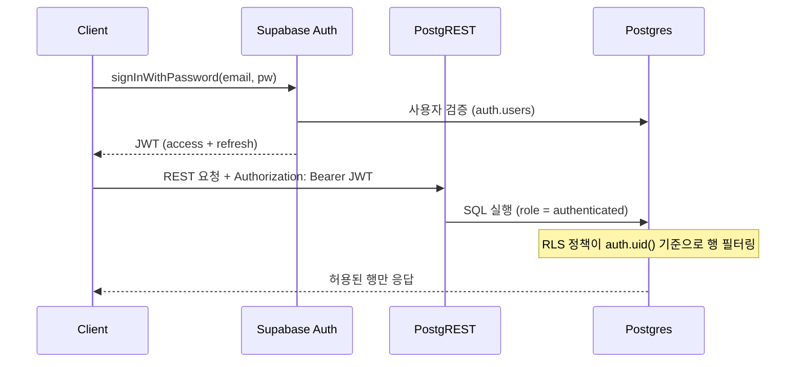

# Supabase 스터디

Postgres 기반 BaaS 훑어보기

<div class="pt-10 text-sm opacity-60">
방향키 → 로 진행하세요
</div>

---

## Supabase란?

<v-clicks>

- 오픈소스 Firebase 대안 — 핵심은 **그냥 Postgres**다
- Auth · Storage · Realtime · Edge Functions를 한 프로젝트로 제공
- 모든 기능이 Postgres 확장/스키마 위에 구현되어 있어 SQL로 직접 만질 수 있다
- 로컬 개발 스택도 Docker로 통째로 제공

</v-clicks>

```bash
# CLI 설치 후 프로젝트 초기화
## 로컬 스택 전체(Postgres, Auth, Storage...)가 Docker로 뜬다
supabase init
supabase start
```

---

## Auth 플로우

이메일 로그인 기준. 발급된 JWT의 `sub` 클레임이 이후 RLS에서 `auth.uid()`로 쓰인다.



---

## RLS 정책

테이블 단위로 켜고, 정책은 연산별로 쌓는다. 클라이언트에 anon key가 노출되어도 RLS가 최후의 방어선.

```sql {1-3|5-8|all}
-- 1. 테이블에 RLS 활성화 (이후 정책 없으면 전부 거부)
alter table posts
  enable row level security;

-- 2. 자기 글만 수정 가능하도록 정책 추가
create policy "update own posts" on posts
  for update
  using (auth.uid() = author_id);
```

---

## Realtime

Postgres의 논리 복제(WAL)를 구독해서 변경 사항을 WebSocket으로 밀어준다.

```ts
const channel = supabase
  .channel('room-1')
  .on(
    'postgres_changes',
    { event: 'INSERT', schema: 'public', table: 'messages' },
    payload => console.log('새 메시지:', payload.new),
  )
  .subscribe()
```

<v-click>

주의: Realtime을 켠 테이블에도 **RLS는 그대로 적용**된다. 구독했다고 다 보이는 게 아니다.

</v-click>

---

## 정리

| 기능 | 실체 |
|---|---|
| Auth | `auth` 스키마 + JWT 발급 서버 |
| RLS | Postgres 네이티브 기능, Supabase는 헬퍼(`auth.uid()`)만 얹음 |
| Realtime | WAL 논리 복제 → WebSocket 브로드캐스트 |

핵심 멘탈 모델: **"Supabase를 배운다" ≈ "Postgres를 배운다"**
